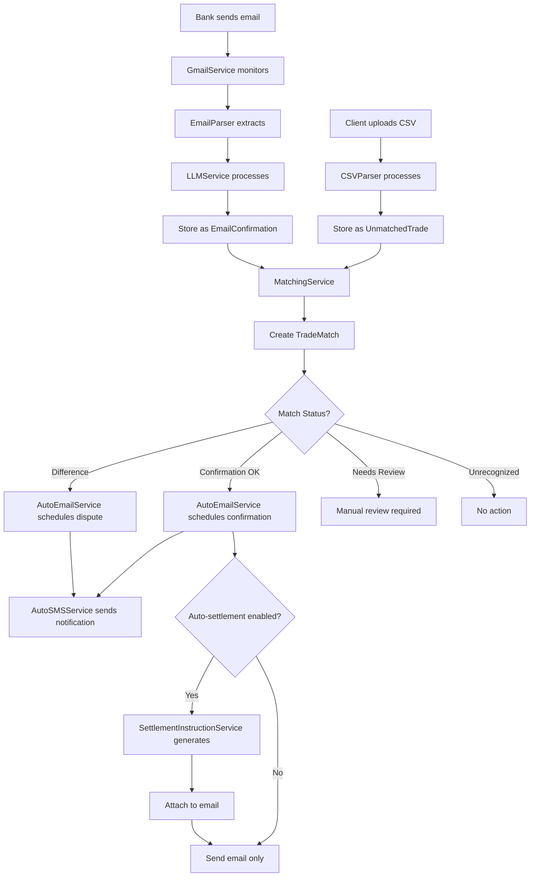
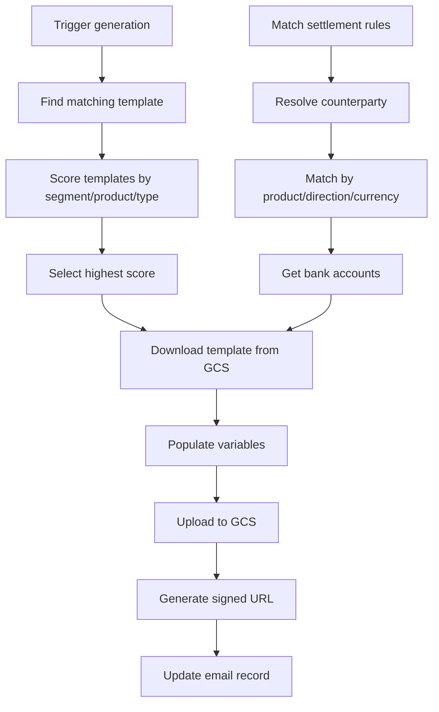
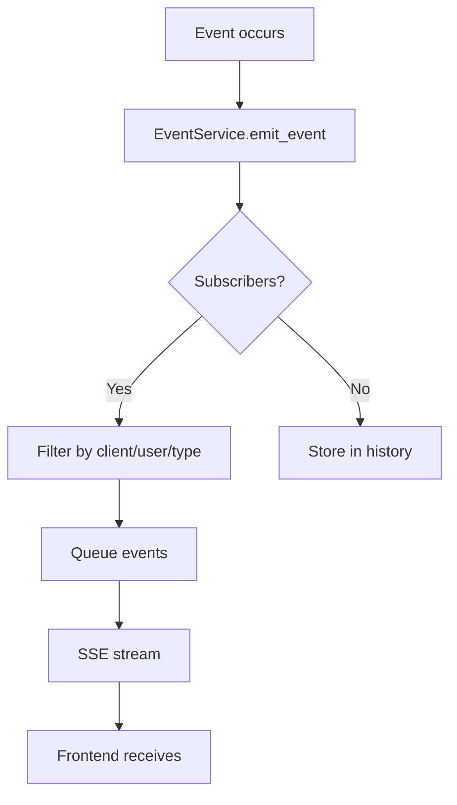
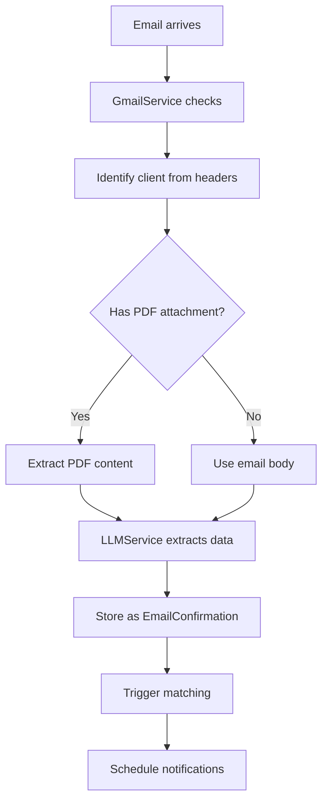

# Backend Architecture Summary - CCM 2.0
## Client Confirmation Manager Backend

---

## Table of Contents
1. [System Overview](#system-overview)
2. [Technology Stack](#technology-stack)
3. [Architecture Components](#architecture-components)
4. [API Endpoints](#api-endpoints)
5. [Data Models](#data-models)
6. [Services Layer](#services-layer)
7. [Configuration & Infrastructure](#configuration--infrastructure)
8. [Business Workflows](#business-workflows)
9. [Security & Authentication](#security--authentication)
10. [Integration Points](#integration-points)
11. [Dependencies Map](#dependencies-map)
12. [Key Features Summary](#key-features-summary)

---

## System Overview

CCM 2.0 (Client Confirmation Manager) is a multi-tenant SaaS platform designed for the Chilean banking industry to manage foreign exchange (FX) trade confirmations and settlements. The backend provides:

- **Trade Matching**: Automated matching of client trades with bank confirmations using fuzzy matching algorithms
- **Settlement Management**: Generation of settlement instruction documents from templates
- **Multi-tenancy**: Supporting both banks and their clients with organization isolation
- **Real-time Notifications**: Server-Sent Events for live updates, SMS and email alerts
- **Automation**: Configurable auto-confirmation, auto-dispute, and auto-settlement instruction generation
- **Document Processing**: PDF and MSG email parsing with LLM-powered data extraction

### Domain Context
- **Banks**: Issue trade confirmations to their clients
- **Clients**: Upload their trade records for matching with bank confirmations
- **Trade Lifecycle**: Upload → Parse → Match → Confirm/Dispute → Settle

---

## Technology Stack

### Core Framework
- **FastAPI** 0.104.1 - Async Python web framework
- **Uvicorn** 0.24.0 - ASGI server with standard extras
- **Python** 3.8+ - Primary programming language

### Database & Storage
- **Google Firestore** - NoSQL document database with CMEK encryption
  - Default database: `(default)`
  - CMEK database: `ccm-development` (production data)
- **Google Cloud Storage** - Document storage for settlement instructions
  - Bucket: `ccm-dev-pool-settlement-documents`
  - Region: `southamerica-west1` (Santiago)

### Authentication & Security
- **Firebase Admin SDK** 6.2.0 - User authentication and management
- **Firebase Auth** - Token-based authentication
- **CMEK** (Customer-Managed Encryption Keys) - Data encryption at rest

### Cloud Services
- **Google Cloud Tasks** 2.14.1 - Background job processing
- **Gmail API** - Email monitoring and sending
- **Google Application Default Credentials** (ADC) - Service authentication

### AI & Processing
- **Anthropic Claude** (claude-sonnet-4-5) - Trade data extraction from emails
- **Vertex AI** - Alternative LLM provider (future)

### Communication
- **Bird API** - SMS messaging platform
- **Gmail** - Email sending with domain-wide delegation
- **Server-Sent Events** (SSE) - Real-time browser notifications

### Document Processing
- **extract_msg** 0.47.0 - Outlook MSG file parsing
- **PyPDF2** 3.0.1 - PDF text extraction
- **python-docx** 1.1.0 - Word document manipulation
- **docx2pdf** 0.1.8 - DOCX to PDF conversion
- **mammoth** 1.6.0 - Alternative DOCX to HTML conversion
- **weasyprint** 60.2 - HTML to PDF conversion
- **reportlab** 4.0.7 - PDF generation

### Data Processing
- **Pydantic** 2.5.0 - Data validation and serialization
- **python-multipart** 0.0.6 - File upload handling

---

## Architecture Components

### Layer Structure
```
┌─────────────────────────────────────┐
│         Frontend (React)            │
├─────────────────────────────────────┤
│      API Routes (FastAPI)           │
├─────────────────────────────────────┤
│     Middleware (Auth, CORS)         │
├─────────────────────────────────────┤
│      Services (Business Logic)      │
├─────────────────────────────────────┤
│        Models (Pydantic)            │
├─────────────────────────────────────┤
│  Infrastructure (Firestore, GCS)    │
└─────────────────────────────────────┘
```

### Directory Structure
```
backend/
├── src/
│   ├── main.py                    # Application entry point
│   ├── api/
│   │   ├── middleware/            # Auth and CORS middleware
│   │   └── routes/                # API endpoint definitions
│   ├── config/                    # Configuration management
│   ├── models/                    # Pydantic data models
│   ├── services/                  # Business logic services
│   └── utils/                     # Utility functions
├── requirements.txt               # Python dependencies
└── test_*.py                      # Test files
```

---

## API Endpoints

### Authentication (`/api/v1/auth`)
| Method | Endpoint | Description | Auth Required |
|--------|----------|-------------|---------------|
| POST | `/verify` | Verify Firebase token and get user profile | No |
| GET | `/profile` | Get current user profile | Yes |
| GET | `/permissions` | Get user permissions | Yes |
| GET | `/context` | Get full auth context (debug) | Yes |

### Users (`/api/v1/users`)
| Method | Endpoint | Description | Permission |
|--------|----------|-------------|------------|
| GET | `/me` | Get current user | - |
| PUT | `/me` | Update current user | - |
| GET | `/{user_uid}` | Get specific user | view_users |
| PUT | `/{user_uid}` | Update specific user | manage_users |
| GET | `/` | List organization users | view_users |
| GET | `/roles/available` | Get available roles | - |

### Clients (`/api/v1/clients`)

#### Core Client Operations
| Method | Endpoint | Description |
|--------|----------|-------------|
| GET | `/` | List all clients |
| GET | `/{client_id}/settings` | Get client settings |
| PUT | `/{client_id}/settings` | Update client settings |

#### Bank Accounts
| Method | Endpoint | Description |
|--------|----------|-------------|
| GET | `/{client_id}/bank-accounts` | List accounts |
| POST | `/{client_id}/bank-accounts` | Create account |
| GET | `/{client_id}/bank-accounts/{account_id}` | Get account |
| PUT | `/{client_id}/bank-accounts/{account_id}` | Update account |
| DELETE | `/{client_id}/bank-accounts/{account_id}` | Delete account |

#### Settlement Rules
| Method | Endpoint | Description |
|--------|----------|-------------|
| GET | `/{client_id}/settlement-rules` | List rules |
| POST | `/{client_id}/settlement-rules` | Create rule |
| GET | `/{client_id}/settlement-rules/{rule_id}` | Get rule |
| PUT | `/{client_id}/settlement-rules/{rule_id}` | Update rule |
| DELETE | `/{client_id}/settlement-rules/{rule_id}` | Delete rule |

#### Trade Management
| Method | Endpoint | Description |
|--------|----------|-------------|
| GET | `/{client_id}/unmatched-trades` | Get unmatched trades |
| GET | `/{client_id}/email-confirmations` | Get email confirmations |
| GET | `/{client_id}/matches` | Get trade matches |
| GET | `/{client_id}/matched-trades` | Get matched trades with details |
| POST | `/{client_id}/upload-trades` | Upload CSV trades |
| POST | `/{client_id}/upload-emails` | Upload email confirmations |
| DELETE | `/{client_id}/unmatched-trades` | Delete all unmatched trades |
| PATCH | `/{client_id}/trades/{trade_id}/status` | Update trade status |
| PATCH | `/{client_id}/email-confirmations/{email_id}/status` | Update email status |
| POST | `/{client_id}/process-matches` | Run matching algorithm |

#### Settlement Instructions
| Method | Endpoint | Description |
|--------|----------|-------------|
| POST | `/{client_id}/settlement-instructions/generate` | Generate settlement document |
| POST | `/{client_id}/settlement-instructions/get-url` | Get document URL |

### Banks (`/api/v1/banks`)

#### Bank Management
| Method | Endpoint | Description |
|--------|----------|-------------|
| GET | `/{bank_id}` | Get bank info |
| PUT | `/{bank_id}` | Update bank info |
| GET | `/{bank_id}/system-settings` | Get system settings |
| PUT | `/{bank_id}/system-settings` | Update system settings |

#### Client Segments
| Method | Endpoint | Description |
|--------|----------|-------------|
| GET | `/{bank_id}/client-segments` | List segments |
| POST | `/{bank_id}/client-segments` | Create segment |
| GET | `/{bank_id}/client-segments/{segment_id}` | Get segment |
| PUT | `/{bank_id}/client-segments/{segment_id}` | Update segment |
| DELETE | `/{bank_id}/client-segments/{segment_id}` | Delete segment |

#### Settlement Letters
| Method | Endpoint | Description |
|--------|----------|-------------|
| GET | `/{bank_id}/settlement-letters` | List templates |
| POST | `/{bank_id}/settlement-letters` | Create template |
| POST | `/{bank_id}/settlement-letters/with-document` | Create with upload |
| GET | `/{bank_id}/settlement-letters/{letter_id}` | Get template |
| PUT | `/{bank_id}/settlement-letters/{letter_id}` | Update template |
| PUT | `/{bank_id}/settlement-letters/{letter_id}/with-document` | Update with upload |
| DELETE | `/{bank_id}/settlement-letters/{letter_id}` | Delete template |
| GET | `/{bank_id}/settlement-letters/{letter_id}/document/preview` | Get preview URL |
| DELETE | `/{bank_id}/settlement-letters/{letter_id}/document` | Delete document |

#### Client Assignments
| Method | Endpoint | Description |
|--------|----------|-------------|
| GET | `/{bank_id}/client-assignments` | Get assignments |
| POST | `/{bank_id}/client-assignments/assign` | Assign client |
| POST | `/{bank_id}/client-assignments/bulk-assign` | Bulk assign |
| DELETE | `/{bank_id}/client-assignments/{client_id}/{segment_id}` | Remove assignment |

### Gmail Monitoring (`/api/v1/gmail`)
| Method | Endpoint | Description | Permission |
|--------|----------|-------------|------------|
| POST | `/check-now` | Manual email check | manage_gmail |
| POST | `/start-monitoring` | Start monitoring | manage_gmail |
| POST | `/stop-monitoring` | Stop monitoring | manage_gmail |
| GET | `/status` | Get service status | manage_gmail |
| POST | `/initialize` | Initialize service | manage_gmail |

### Events (`/api/v1/events`)
| Method | Endpoint | Description | Auth |
|--------|----------|-------------|------|
| GET | `/stream` | SSE real-time stream | Token |
| POST | `/test` | Test event trigger | None |
| GET | `/test-stream` | Test SSE stream | None |
| GET | `/stats` | Connection statistics | Admin |

### SMS (`/api/v1/sms`)
| Method | Endpoint | Description |
|--------|----------|-------------|
| POST | `/test` | Send test SMS |
| GET | `/validate` | Validate configuration |
| POST | `/send-trade-notification` | Send trade SMS |

### Internal Tasks (`/api/internal/tasks`)
| Method | Endpoint | Description | Auth |
|--------|----------|-------------|------|
| POST | `/email` | Process email tasks | Cloud Tasks |
| POST | `/general` | Process general tasks | Cloud Tasks |
| POST | `/priority` | Process priority tasks | Cloud Tasks |
| POST | `/file-processing` | Process file tasks | Cloud Tasks |
| GET | `/stats` | Task statistics | None |

### Health (`/`)
| Method | Endpoint | Description |
|--------|----------|-------------|
| GET | `/` | Service info |
| GET | `/health` | Health check |

---

## Data Models

### Core Entity Hierarchy

```
Organization (Abstract)
├── Bank
│   ├── ClientSegment[]
│   ├── SettlementInstructionLetter[]
│   └── BankSystemSettings
└── Client
    ├── ClientSettings
    ├── BankAccount[]
    ├── SettlementRule[]
    ├── DataMapping[]
    ├── UnmatchedTrade[]
    ├── EmailConfirmation[]
    └── TradeMatch[]

User
├── Role[]
├── LoginMetadata
└── ClientUserOverride[] (per client)
```

### Key Model Relationships

#### Trade Processing Flow
1. **UnmatchedTrade** - Client's trade data from CSV
2. **EmailConfirmation** - Bank's confirmation from email/PDF
3. **TradeMatch** - Links trade + confirmation with score
4. **UploadSession** - Tracks file processing

#### Settlement Flow
1. **SettlementRule** - Client's settlement preferences
2. **BankAccount** - Client's bank accounts
3. **SettlementInstructionLetter** - Bank's document templates
4. **ClientSegment** - Client categorization for templates

### Model Field Patterns
- **BaseFirestoreModel**: Common fields (id, created_at, last_updated_at, last_updated_by)
- **Status Fields**: active, status (active/inactive/pending)
- **Organization Scoping**: organization_id for multi-tenancy
- **Soft Deletes**: Using status fields instead of hard deletes
- **Audit Trail**: last_updated_by for change tracking

### Critical Business Rules

#### Trade Matching
- **Confidence Score**: 0-1 float range
- **Match Threshold**: 60 points minimum
- **Auto-confirm Threshold**: 70 points
- **Currency Match**: Mandatory for matching
- **Critical Fields**: 2 of 3 must match (Counterparty, Date, Currency)

#### Settlement Rules
- **Direction**: compra (buy) or venta (sell)
- **Modalidad**: entregaFisica or compensacion
- **Priority**: Lower number = higher priority
- **Account Resolution**: Based on currency and direction

#### Status Values
- **Trade Status**: unmatched, matched, confirmed_via_portal, disputed
- **Email Status**: Confirmation OK, Difference, Needs Review, Unrecognized
- **User Status**: active, inactive, pending, suspended
- **Upload Status**: processing, completed, failed

---

## Services Layer

### Core Services Architecture

#### 1. **ClientService** (Central Orchestrator)
- **Size**: ~2700 lines (largest service)
- **Purpose**: Orchestrates all client-related operations
- **Key Responsibilities**:
  - Trade upload processing (CSV)
  - Email confirmation processing (MSG/PDF)
  - Trade matching coordination
  - Settings management
  - Bank account and settlement rule management
- **Dependencies**: CSVParser, EmailParser, LLMService, MatchingService, TaskQueueService, AutoEmailService, AutoSMSService

#### 2. **GmailService** (Email Gateway)
- **Purpose**: Gmail API integration for monitoring and sending
- **Key Features**:
  - Continuous inbox monitoring (30s intervals)
  - Domain-wide delegation for confirmaciones_dev@servicios.palace.cl
  - Automatic client identification from email headers
  - PDF attachment priority processing
- **Dependencies**: ClientService, EmailParser

#### 3. **LLMService** (AI Processing)
- **Purpose**: Extract structured trade data from unstructured emails
- **LLM Provider**: Anthropic Claude (claude-sonnet-4-5)
- **Critical Logic**:
  - Perspective reversal (bank→client view)
  - Direction detection (Buy/Sell from client perspective)
  - Field normalization and mapping
  - Multi-trade email handling
- **Output**: Structured JSON matching v1.0 trade specification

#### 4. **MatchingService** (v2.0 Algorithm)
- **Purpose**: Fuzzy matching of trades with confirmations
- **Scoring System** (100 points total):
  - Counterparty: 25pts exact, 15pts partial
  - Trade date: 25pts
  - Currency pair: 30pts exact, 25pts reversed (MANDATORY)
  - Amount: 15pts exact, 10pts close (0.1% tolerance)
  - Product type: 5pts
- **Match Statuses**:
  - Confirmation OK: ≥70pts, no discrepancies
  - Difference: ≥70pts, with discrepancies
  - Needs Review: 60-69pts
  - Unrecognized: <60pts

#### 5. **SettlementInstructionService**
- **Purpose**: Generate populated settlement documents
- **Template Matching Score**:
  - Client segment: +200pts
  - Settlement type: +100pts
  - Product match: +50pts partial, +30pts contains
  - Default template: +10pts
  - Priority bonus: +(1000-priority)
- **Variable Replacement**: Trade details, amounts, accounts, localized terms

#### 6. **TaskQueueService**
- **Purpose**: Background job scheduling via Cloud Tasks
- **Queues**:
  - GENERAL: 1hr max delay
  - EMAIL: 24hr max delay
  - PRIORITY: 5min max delay
  - FILE_PROCESSING: 2hr max delay
- **Task Types**: email_confirmation, email_dispute, file_upload, notification, cleanup

#### 7. **AutoEmailService**
- **Purpose**: Automated email scheduling based on trade status
- **Features**:
  - Configurable delays (30min confirmation, 60min dispute)
  - Auto-settlement instruction attachment
  - Multi-language support (es/en/pt)
  - CC recipient configuration
- **Integration**: Uses shared functions from SettlementInstructionService

#### 8. **AutoSMSService**
- **Purpose**: SMS notifications for trade events
- **Message Types**:
  - Confirmation: Trade details and status
  - Dispute: Discrepancy count and action required
- **Constraints**: 160 character limit, rate limiting

#### 9. **EventService**
- **Purpose**: Real-time notifications via Server-Sent Events
- **Event Types**:
  - trade_matched, trade_unmatched
  - email_processed, settlement_generated
  - system_alert
- **Features**: Client filtering, priority levels, connection management

#### 10. **BankService**
- **Purpose**: Bank configuration and client segmentation
- **Key Features**:
  - Settlement letter template management
  - Client segment assignments
  - PDF preview generation from DOCX
  - System settings management

#### 11. **StorageService**
- **Purpose**: Google Cloud Storage integration
- **Storage Path**: `{bank_id}/{segment_id}/{timestamp}_{filename}_{uuid}.{ext}`
- **Features**:
  - CMEK encryption
  - Signed URL generation (60min default)
  - File validation (size, type, signature)

#### 12. **UserService**
- **Purpose**: User profile and permission management
- **Features**:
  - Role-based permissions aggregation
  - Organization references
  - Login tracking
  - Profile management

#### 13. **SMSService**
- **Purpose**: Bird API integration for SMS
- **Features**:
  - International format validation
  - Chilean number handling (+56)
  - Rate limiting
  - Bulk sending

#### 14. **EmailParser**
- **Purpose**: Extract trade data from MSG/PDF files
- **Processing Priority**:
  1. PDF attachments (most accurate)
  2. Email body text (fallback)
- **Output**: Email metadata + LLM-extracted trade data

#### 15. **CSVParser**
- **Purpose**: Parse client trade CSV files
- **Features**:
  - Column name mapping to v1.0 spec
  - Date format conversion (DD/MM/YYYY → DD-MM-YYYY)
  - Numeric normalization
  - Missing field detection

---

## Configuration & Infrastructure

### Environment Configuration

#### Settings Management (`settings.py`)
```python
# Core Settings
ENVIRONMENT: development/production
FIREBASE_PROJECT_ID: ccm-dev-pool
FIREBASE_DATABASE_ID: ccm-development (CMEK)

# API Keys
ANTHROPIC_API_KEY: For LLM service
BIRD_API_KEY: For SMS service
BIRD_WORKSPACE_ID: Bird workspace
BIRD_CHANNEL_ID: Bird channel

# Service Configuration
LLM_PROVIDER: anthropic/vertex
SMS_RATE_LIMIT_PER_MINUTE: 10
SMS_DAILY_LIMIT_DEFAULT: 100
```

#### Firebase Configuration (`firebase_config.py`)
- **Databases**:
  - Default: `(default)` database
  - CMEK: `ccm-development` database (production data)
- **Authentication**: Firebase Admin SDK
- **Emulator Support**: Local development testing

#### Storage Configuration (`storage_config.py`)
- **Bucket**: ccm-dev-pool-settlement-documents
- **Region**: southamerica-west1 (Santiago)
- **Limits**: 10MB max file size
- **Allowed Types**: DOCX, PDF
- **Service Account**: ccm-storage-service@ccm-dev-pool.iam.gserviceaccount.com

### Middleware

#### AuthMiddleware
- **Token Validation**: Firebase token verification
- **User Loading**: Profile and permissions
- **Context Creation**: AuthContext for request handling
- **Excluded Paths**: Health, docs, internal tasks
- **Permission Decorator**: @require_permission()

### Security Features
- **CMEK Encryption**: Customer-managed encryption at rest
- **Token Authentication**: Firebase JWT tokens
- **Organization Isolation**: Multi-tenant data separation
- **Permission System**: Role-based access control
- **Audit Trail**: last_updated_by tracking
- **Signed URLs**: Temporary document access

---

## Business Workflows

### 1. Trade Upload and Matching Workflow



### 2. Settlement Instruction Generation



### 3. Real-time Event Flow



### 4. Email Processing Pipeline



---

## Security & Authentication

### Authentication Flow
1. Frontend sends Firebase token in Authorization header
2. AuthMiddleware validates token
3. User profile loaded from Firestore
4. Permissions aggregated from roles
5. AuthContext created for request
6. Route handlers check permissions

### Permission System

#### Role-Based Permissions
- **view_users**: View user profiles
- **manage_users**: Edit user profiles
- **manage_settings**: Edit client settings
- **manage_bank_accounts**: CRUD bank accounts
- **manage_settlement_rules**: CRUD settlement rules
- **manage_data_mappings**: CRUD data mappings
- **manage_client_segments**: Manage segments
- **manage_instruction_letters**: Manage templates
- **manage_bank_settings**: Edit bank settings
- **manage_gmail**: Control Gmail service

#### Organization Access
- Users can only access their organization's data
- Bank users may have elevated access to client data
- Cross-organization access validated in services

### Data Security
- **CMEK Encryption**: All production data encrypted at rest
- **Firestore Security Rules**: Additional layer of access control
- **Signed URLs**: Temporary document access (default 60min)
- **Service Account Impersonation**: Limited scope credentials
- **Cloud Tasks Authentication**: Request header validation

---

## Integration Points

### External Services

#### Gmail API
- **Account**: confirmaciones_dev@servicios.palace.cl
- **Method**: Domain-wide delegation
- **Scopes**: Read, send, modify
- **Monitoring**: 30-second polling interval

#### Anthropic Claude API
- **Model**: claude-sonnet-4-5
- **Purpose**: Trade data extraction
- **Temperature**: 0 (deterministic)
- **Context**: Client name for perspective

#### Bird SMS API
- **Endpoint**: https://api.bird.com/v1/messages
- **Authentication**: API key
- **Rate Limiting**: 10/minute default
- **Format**: International (+56 for Chile)

#### Google Cloud Services
- **Firestore**: NoSQL database
- **Cloud Storage**: Document storage
- **Cloud Tasks**: Background jobs
- **Application Default Credentials**: Service auth

### Internal Service Dependencies

```
GmailService
└── ClientService
    ├── CSVParser
    ├── EmailParser
    │   └── LLMService
    ├── MatchingService
    ├── AutoEmailService
    │   ├── TaskQueueService
    │   └── SettlementInstructionService
    │       ├── BankService
    │       └── StorageService
    └── AutoSMSService
        └── SMSService

EventService (standalone, publishes to all)

UserService (used by AuthMiddleware and routes)

BankService
└── StorageService
```

---

## Dependencies Map

### Service Inter-dependencies

| Service | Depends On | Used By |
|---------|------------|---------|
| ClientService | EmailParser, CSVParser, LLMService, MatchingService, TaskQueueService, AutoEmailService, AutoSMSService, EventService | GmailService, Routes |
| GmailService | ClientService, EmailParser | Main (startup) |
| LLMService | Anthropic SDK | EmailParser |
| MatchingService | - | ClientService |
| SettlementInstructionService | BankService, StorageService | ClientService, AutoEmailService |
| TaskQueueService | Cloud Tasks SDK | AutoEmailService, ClientService |
| AutoEmailService | TaskQueueService, GmailService, SettlementInstructionService | ClientService |
| AutoSMSService | SMSService | ClientService |
| EventService | - | All services |
| BankService | StorageService | SettlementInstructionService, Routes |
| StorageService | Cloud Storage SDK | BankService, SettlementInstructionService |
| UserService | Firestore | AuthMiddleware, Routes |
| SMSService | Bird API | AutoSMSService |
| EmailParser | LLMService | ClientService, GmailService |
| CSVParser | - | ClientService |

### Database Collections Used

| Service | Collections |
|---------|------------|
| ClientService | clients/*, trades, emails, uploadSessions, settings, bankAccounts, settlementRules, dataMappings |
| UserService | users, roles |
| BankService | banks, clientSegments, settlementInstructionLetters, systemSettings, clientSegmentAssignments |
| EventService | events (in-memory) |
| SettlementInstructionService | banks/settlementInstructionLetters, clients/settlementRules, clients/bankAccounts |

### External API Dependencies

| Service | External API | Purpose |
|---------|--------------|---------|
| GmailService | Gmail API | Email monitoring and sending |
| LLMService | Anthropic API | Trade data extraction |
| SMSService | Bird API | SMS messaging |
| StorageService | Google Cloud Storage | Document storage |
| TaskQueueService | Google Cloud Tasks | Background processing |

---

## Key Features Summary

### Core Capabilities

#### 1. Multi-Tenant Architecture
- Organization-level data isolation
- Bank and client separation
- Role-based access control
- Cross-organization validation

#### 2. Automated Trade Processing
- CSV upload and parsing
- Email/PDF processing with AI
- Fuzzy matching algorithm v2.0
- Auto-confirmation/dispute scheduling

#### 3. Settlement Management
- Template-based document generation
- Rule-based account resolution
- Client segmentation for templates
- Multi-language support

#### 4. Real-Time Communication
- Server-Sent Events for live updates
- SMS notifications via Bird
- Email alerts via Gmail
- Event filtering and prioritization

#### 5. Automation Features
- **Auto-confirmation**: Configurable delay, matched trades
- **Auto-dispute**: Configurable delay, discrepancies
- **Auto-settlement**: Document generation and attachment
- **Auto-SMS**: Trade status notifications

#### 6. Document Processing
- MSG email parsing
- PDF text extraction
- DOCX template manipulation
- PDF preview generation

#### 7. Background Processing
- Cloud Tasks integration
- Delayed task execution
- Queue prioritization
- Retry with backoff

### Configuration Options

#### Per-Client Settings
- Automation toggles (auto-confirm, auto-dispute, auto-settlement)
- Alert configurations (email lists, phone numbers)
- Preferences (language, timezone, date format)
- Settlement rules (priority-based)
- Bank accounts (multiple currencies)

#### Per-Bank Settings
- Client segments (categorization)
- Settlement letter templates
- System settings (currencies, products)
- Template variables and conditions

### Monitoring & Observability
- Comprehensive logging
- Event statistics
- Task queue monitoring
- Gmail service status
- Upload session tracking

---

## Critical Implementation Notes

### Performance Considerations
1. **Matching Algorithm**: O(n*m) complexity for n emails and m trades
2. **LLM Calls**: ~2-3 second latency per email
3. **Gmail Polling**: 30-second intervals to avoid rate limits
4. **SMS Rate Limiting**: 10 messages/minute default
5. **SSE Connections**: Non-blocking event queues per connection

### Data Consistency
1. **Soft Deletes**: Status fields instead of deletion
2. **Audit Trail**: last_updated_by on all documents
3. **Upload Sessions**: Track processing state
4. **Idempotency**: Message ID tracking for Gmail

### Error Handling
1. **Service Fallbacks**: Multiple PDF conversion methods
2. **Retry Logic**: Cloud Tasks exponential backoff
3. **Graceful Degradation**: Continue on non-critical failures
4. **Error Logging**: Contextual information included

### Scalability Factors
1. **Database**: Firestore auto-scales
2. **Background Jobs**: Cloud Tasks queues
3. **Document Storage**: GCS with regional replication
4. **API Rate Limits**: Configurable per service

### Security Best Practices
1. **Token Validation**: Every request except public endpoints
2. **CMEK Encryption**: Production data at rest
3. **Signed URLs**: Temporary document access
4. **Service Account Impersonation**: Limited scopes
5. **Organization Isolation**: Multi-tenant separation

---

## Refactoring Opportunities

Based on the analysis, potential areas for refactoring:

### 1. Service Decomposition
- **ClientService** is too large (~2700 lines)
- Consider splitting into: TradeService, MatchingCoordinator, SettingsService

### 2. Shared Functions
- Settlement data preparation duplicated
- Email status updates could be centralized
- Common validation logic extraction

### 3. Configuration Management
- Move hardcoded values to settings
- Centralize email templates
- Externalize matching weights

### 4. Error Handling Standardization
- Consistent error response format
- Centralized error codes
- Better error context propagation

### 5. Testing Infrastructure
- Many test_*.py files at root level
- Consider organized test directory
- Add integration test suite

### 6. Documentation
- API documentation generation
- Service interface contracts
- Deployment documentation

---

## Conclusion

The CCM 2.0 backend is a sophisticated, production-ready system for managing FX trade confirmations and settlements. It implements:

- **Robust Architecture**: Clean separation of concerns with FastAPI, services, and models
- **Enterprise Features**: Multi-tenancy, RBAC, audit trails, encryption
- **Intelligent Processing**: AI-powered extraction, fuzzy matching, auto-generation
- **Real-time Capabilities**: SSE events, monitoring, notifications
- **Cloud-Native**: Full GCP integration with managed services
- **Extensible Design**: Configurable rules, templates, and automation

The system successfully handles the complete trade lifecycle from upload through confirmation to settlement, with comprehensive automation options and real-time feedback mechanisms.