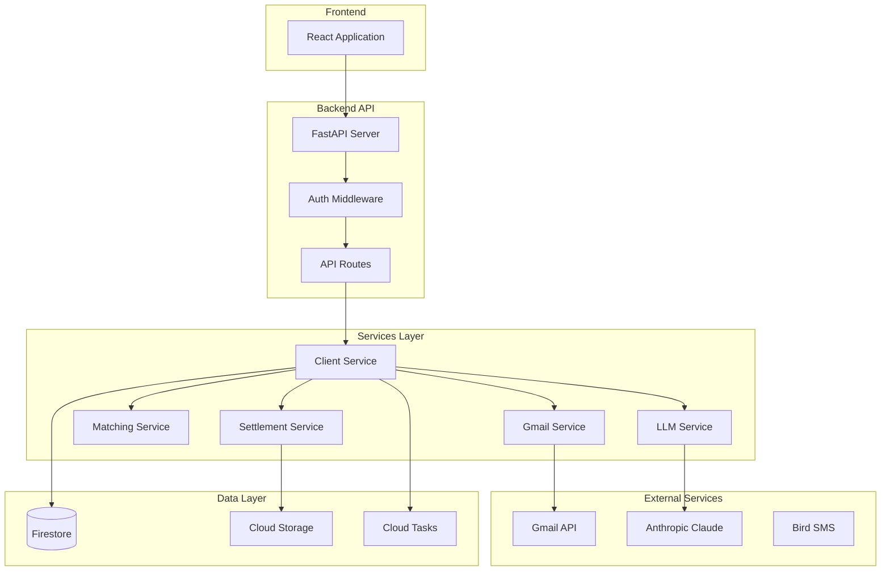

# CCM 2.0 Backend Documentation

Welcome to the Client Confirmation Manager (CCM) 2.0 backend documentation. This documentation provides comprehensive information about the backend architecture, APIs, and services.

## What is CCM 2.0?

CCM 2.0 is a multi-tenant SaaS platform designed for the Chilean banking industry to manage foreign exchange (FX) trade confirmations and settlements. The system automates the matching of client trades with bank confirmations, generates settlement instructions, and provides real-time notifications.

## Key Features

- 🔄 **Automated Trade Matching** - Intelligent fuzzy matching algorithm (v2.0) with configurable thresholds
- 📄 **Settlement Management** - Template-based document generation with multi-language support
- 🏢 **Multi-tenancy** - Complete organization isolation for banks and clients
- 📡 **Real-time Updates** - Server-Sent Events for live notifications
- 🤖 **AI-Powered Processing** - LLM-based extraction of trade data from emails
- 📧 **Email & SMS Automation** - Configurable notifications for trade events
- 🔐 **Enterprise Security** - CMEK encryption, RBAC, and comprehensive audit trails

## Quick Links

- [Installation Guide](getting-started/installation.md) - Set up your development environment
- [API Reference](api/index.md) - Complete API endpoint documentation
- [Service Documentation](services/index.md) - Detailed service layer documentation
- [Architecture Overview](architecture/overview.md) - System design and patterns

## System Overview

## Technology Stack

| Component | Technology | Purpose |
|-----------|------------|---------|
| Framework | FastAPI 0.104.1 | Async REST API |
| Database | Google Firestore | NoSQL with CMEK encryption |
| Storage | Google Cloud Storage | Document storage |
| Authentication | Firebase Auth | Token-based auth |
| Task Queue | Google Cloud Tasks | Background processing |
| AI/ML | Anthropic Claude | Trade data extraction |
| Email | Gmail API | Email monitoring & sending |
| SMS | Bird API | SMS notifications |
| Real-time | Server-Sent Events | Live updates |

## Documentation Structure

This documentation is organized into the following sections:

### 📚 Getting Started
Everything you need to set up and run the backend locally.

### 🏗️ Architecture
Deep dive into system design, patterns, and database schema.

### 🔌 API Reference
Complete documentation of all REST endpoints with examples.

### ⚙️ Services
Detailed documentation of the business logic layer.

### 📊 Models
Data models and validation rules.

### 🔧 Configuration
Environment variables and settings management.

### 💻 Development
Guidelines for development, testing, and debugging.

### 🚀 Deployment
Production deployment guides and monitoring.

### 📖 Guides
Step-by-step tutorials for common tasks.

## Contributing

We welcome contributions! Please see our [Contributing Guide](development/contributing.md) for details.

## Support

For questions or issues:
- Check the [FAQ](guides/faq.md)
- Search [existing issues](https://github.com/yourorg/ccm2.0/issues)
- Contact the development team

---

*Last updated: {{ git_revision_date }}*