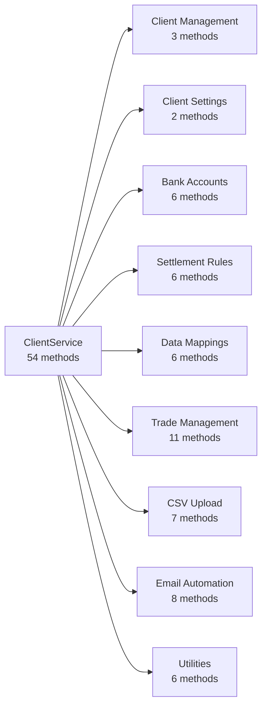
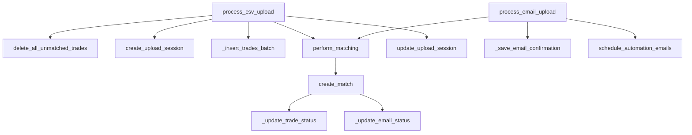
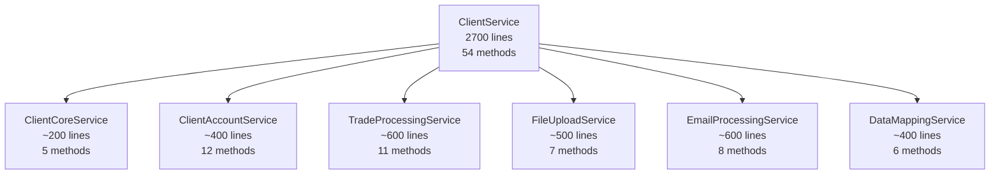

# Client Service

The Client Service is the central orchestrator for all client-related operations in CCM 2.0, managing trade processing, email confirmations, matching workflows, and client configuration.

## Class Overview

::: services.client_service.ClientService
    options:
      show_source: false
      show_bases: false
      members: false

---

## Method Organization

The ClientService contains **54 methods** organized into **9 functional groups**:



---

## 1️⃣ Client Management Methods (3 methods)

Basic client operations and queries.

### Complete Method List

**`get_all_clients()`** → `List[Dict[str, Any]]`
:   Get all clients regardless of bank association
:   Returns list of client dictionaries with id, name, and organization details
:   **Database:** Reads from `clients` collection

**`client_exists(client_id: str)`** → `bool`
:   Check if a client exists by ID
:   Returns True if client exists, False otherwise
:   **Database:** Queries `clients/{client_id}` document

**`get_client_name(client_id: str)`** → `Optional[str]`
:   Get client's display name (client name or organization name)
:   Returns name string or None if not found
:   **Database:** Reads `clients/{client_id}` document

### Example Usage

```python
from services.client_service import ClientService

client_service = ClientService()

# Get all clients
clients = client_service.get_all_clients()
for client in clients:
    print(f"Client: {client['name']} (ID: {client['id']})")

# Check if client exists
if await client_service.client_exists("xyz-corp"):
    name = client_service.get_client_name("xyz-corp")
    print(f"Found client: {name}")
```

---

## 2️⃣ Client Settings Methods (2 methods)

Manage client configuration and preferences.

### Complete Method List

**`get_client_settings(client_id: str)`** → `Optional[ClientSettings]`
:   Retrieve all client settings and configuration
:   Returns ClientSettings model with all preferences
:   **Database:** Reads `clients/{client_id}/settings/configuration`

**`update_client_settings(client_id: str, settings_update: ClientSettingsUpdate, updated_by_uid: str)`** → `ClientSettings`
:   Update client settings with partial updates
:   Merges new settings with existing configuration
:   **Database:** Updates `clients/{client_id}/settings/configuration`

### Example Usage

```python
# Get current settings
settings = await client_service.get_client_settings("xyz-corp")

# Update automation settings
from models.client import ClientSettingsUpdate

update = ClientSettingsUpdate(
    automation={
        "auto_confirm_matched": {
            "enabled": True,
            "delay_minutes": 30
        },
        "auto_carta_instruccion": True
    }
)

updated_settings = await client_service.update_client_settings(
    client_id="xyz-corp",
    settings_update=update,
    updated_by_uid="user-123"
)
```

---

## 3️⃣ Bank Account Methods (6 methods)

CRUD operations for client bank accounts.

### Complete Method List

**`get_bank_accounts(client_id: str)`** → `List[BankAccount]`
:   List all bank accounts for a client
:   Returns list of BankAccount models sorted by creation date
:   **Database:** Reads `clients/{client_id}/bankAccounts` subcollection

**`get_bank_account(client_id: str, account_id: str)`** → `Optional[BankAccount]`
:   Get specific bank account by ID
:   Returns BankAccount model or None if not found
:   **Database:** Reads `clients/{client_id}/bankAccounts/{account_id}`

**`create_bank_account(client_id: str, account_data: BankAccountCreate, created_by_uid: str)`** → `BankAccount`
:   Create new bank account with validation
:   Handles default account designation
:   **Database:** Creates in `clients/{client_id}/bankAccounts`
:   **Calls:** `_unset_default_accounts()` if is_default=True

**`update_bank_account(client_id: str, account_id: str, account_update: BankAccountUpdate, updated_by_uid: str)`** → `BankAccount`
:   Update existing bank account
:   Manages default account changes
:   **Database:** Updates `clients/{client_id}/bankAccounts/{account_id}`
:   **Calls:** `_unset_default_accounts()` if changing default status

**`delete_bank_account(client_id: str, account_id: str)`** → `bool`
:   Delete bank account by ID
:   Returns True if deleted, False if not found
:   **Database:** Deletes from `clients/{client_id}/bankAccounts/{account_id}`

**`_unset_default_accounts(client_id: str, currency: str, exclude_account_id: Optional[str])`** → `None`
:   Internal: Remove default status from other accounts of same currency
:   Ensures only one default per currency
:   **Database:** Updates multiple docs in `clients/{client_id}/bankAccounts`
:   **Called by:** `create_bank_account()`, `update_bank_account()`

### Example Usage

```python
from models.client import BankAccountCreate

# Create a new bank account
account_data = BankAccountCreate(
    account_name="Main USD Account",
    bank_name="Bank of America",
    swift_code="BOFAUS3N",
    account_currency="USD",
    account_number="123456789",
    is_default=True
)

new_account = await client_service.create_bank_account(
    client_id="xyz-corp",
    account_data=account_data,
    created_by_uid="user-123"
)

# List all accounts
accounts = await client_service.get_bank_accounts("xyz-corp")
for account in accounts:
    status = "Default" if account.is_default else "Active"
    print(f"{account.account_name}: {account.account_currency} ({status})")
```

---

## 4️⃣ Settlement Rules Methods (6 methods)

Manage priority-based settlement rules for trade processing.

### Complete Method List

**`get_settlement_rules(client_id: str)`** → `List[SettlementRule]`
:   Get all settlement rules sorted by priority
:   Returns list of SettlementRule models (priority 1 = highest)
:   **Database:** Reads `clients/{client_id}/settlementRules` with ordering

**`get_settlement_rule(client_id: str, rule_id: str)`** → `Optional[SettlementRule]`
:   Get specific settlement rule by ID
:   Returns SettlementRule model or None if not found
:   **Database:** Reads `clients/{client_id}/settlementRules/{rule_id}`

**`create_settlement_rule(client_id: str, rule_data: SettlementRuleCreate, created_by_uid: str)`** → `SettlementRule`
:   Create new settlement rule with priority management
:   Auto-adjusts priorities of existing rules
:   **Database:** Creates in `clients/{client_id}/settlementRules`
:   **Calls:** `_adjust_rule_priorities()` to reorder existing rules

**`update_settlement_rule(client_id: str, rule_id: str, rule_update: SettlementRuleUpdate, updated_by_uid: str)`** → `SettlementRule`
:   Update existing settlement rule
:   Handles priority reordering if needed
:   **Database:** Updates `clients/{client_id}/settlementRules/{rule_id}`
:   **Calls:** `_adjust_rule_priorities()` if priority changed

**`delete_settlement_rule(client_id: str, rule_id: str)`** → `bool`
:   Delete settlement rule by ID
:   Returns True if deleted, False if not found
:   **Database:** Deletes from `clients/{client_id}/settlementRules/{rule_id}`

**`_adjust_rule_priorities(client_id: str, rules: List[SettlementRule], exclude_rule_id: Optional[str])`** → `None`
:   Internal: Reorder rule priorities to prevent gaps/duplicates
:   Ensures continuous priority numbering
:   **Database:** Batch updates to `clients/{client_id}/settlementRules`
:   **Called by:** `create_settlement_rule()`, `update_settlement_rule()`

### Example Usage

```python
from models.client import SettlementRuleCreate

# Create a settlement rule
rule = SettlementRuleCreate(
    name="Default USD Spot Settlement",
    priority=1,  # Highest priority
    direction="compra",  # Buy
    counterparty="*",  # Any counterparty
    product="Spot",
    modalidad="entregaFisica",  # Physical delivery
    cargar_currency="USD",
    cargar_bank_name="Bank of America",
    cargar_swift_code="BOFAUS3N",
    cargar_account_number="123456789",
    abonar_currency="CLP",
    abonar_bank_name="Banco Santander",
    abonar_swift_code="BSCHCLRM",
    abonar_account_number="987654321"
)

created_rule = await client_service.create_settlement_rule(
    client_id="xyz-corp",
    rule_data=rule,
    created_by_uid="user-123"
)
```

---

## 5️⃣ Data Mapping Methods (6 methods)

Configure data mappings for CSV/Excel file imports.

### Complete Method List

**`get_data_mappings(client_id: str)`** → `List[DataMapping]`
:   List all data mappings for a client
:   Returns list of DataMapping models sorted by creation date
:   **Database:** Reads `clients/{client_id}/dataMappings` subcollection

**`get_data_mapping(client_id: str, mapping_id: str)`** → `Optional[DataMapping]`
:   Get specific data mapping by ID
:   Returns DataMapping model or None if not found
:   **Database:** Reads `clients/{client_id}/dataMappings/{mapping_id}`

**`create_data_mapping(client_id: str, mapping_data: DataMappingCreate, created_by_uid: str)`** → `DataMapping`
:   Create new data mapping configuration
:   Handles default mapping designation per file type
:   **Database:** Creates in `clients/{client_id}/dataMappings`
:   **Calls:** `_unset_default_mappings()` if is_default=True

**`update_data_mapping(client_id: str, mapping_id: str, mapping_update: DataMappingUpdate, updated_by_uid: str)`** → `DataMapping`
:   Update existing data mapping
:   Manages default mapping changes
:   **Database:** Updates `clients/{client_id}/dataMappings/{mapping_id}`
:   **Calls:** `_unset_default_mappings()` if changing default status

**`delete_data_mapping(client_id: str, mapping_id: str)`** → `bool`
:   Delete data mapping by ID
:   Returns True if deleted, False if not found
:   **Database:** Deletes from `clients/{client_id}/dataMappings/{mapping_id}`

**`_unset_default_mappings(client_id: str, file_type: str, exclude_mapping_id: Optional[str])`** → `None`
:   Internal: Remove default status from other mappings of same file type
:   Ensures only one default per file type (csv/excel)
:   **Database:** Updates multiple docs in `clients/{client_id}/dataMappings`
:   **Called by:** `create_data_mapping()`, `update_data_mapping()`

---

## 6️⃣ Trade Management Methods (11 methods)

Core trade processing, matching, and confirmation operations.

### Complete Method List

**`get_unmatched_trades(client_id: str)`** → `List[Trade]`
:   Get all trades awaiting matching
:   Returns list of Trade models with status='unmatched'
:   **Database:** Queries `clients/{client_id}/trades` with filter

**`get_email_confirmations(client_id: str)`** → `List[EmailConfirmation]`
:   Get all email confirmations
:   Returns list of EmailConfirmation models sorted by date
:   **Database:** Reads `clients/{client_id}/emails` subcollection

**`get_matched_trades(client_id: str)`** → `List[Dict[str, Any]]`
:   Get all matched trade-email pairs with full details
:   Joins trade and email data with match metadata
:   **Database:** Complex join across trades, emails, matches collections
:   **Calls:** Multiple database queries with aggregation

**`get_trade_by_id(client_id: str, trade_id: str)`** → `Optional[Trade]`
:   Get specific trade by ID
:   Returns Trade model or None if not found
:   **Database:** Reads `clients/{client_id}/trades/{trade_id}`

**`get_email_confirmation(client_id: str, email_id: str)`** → `Optional[EmailConfirmation]`
:   Get specific email confirmation by ID
:   Returns EmailConfirmation model or None if not found
:   **Database:** Reads `clients/{client_id}/emails/{email_id}`

**`create_match(client_id: str, trade_id: str, email_id: str, confidence_score: float, match_type: str, discrepancies: List[str])`** → `TradeEmailMatch`
:   Create new trade-email match record
:   Updates status of both trade and email
:   **Database:** Creates in `clients/{client_id}/matches`
:   **Calls:** `_update_trade_status()`, `_update_email_status()`

**`update_match(client_id: str, match_id: str, match_update: Dict[str, Any])`** → `TradeEmailMatch`
:   Update existing match record
:   Modifies match metadata and statuses
:   **Database:** Updates `clients/{client_id}/matches/{match_id}`

**`delete_match(client_id: str, match_id: str)`** → `bool`
:   Delete match and revert trade/email statuses
:   Returns True if deleted, False if not found
:   **Database:** Deletes from `clients/{client_id}/matches/{match_id}`
:   **Calls:** `_update_trade_status()`, `_update_email_status()`

**`update_email_confirmation_status(client_id: str, email_id: str, status: str, updated_by: str)`** → `bool`
:   Update email confirmation status
:   Returns True if updated, False if not found
:   **Database:** Updates `clients/{client_id}/emails/{email_id}`

**`perform_matching(client_id: str, trade_ids: Optional[List[str]])`** → `Dict[str, Any]`
:   Execute matching algorithm for specified trades
:   Creates matches based on confidence thresholds
:   **External:** Calls MatchingService.match_trades()
:   **Calls:** `create_match()` for each match found

**`get_trade_confirmation_status(client_id: str, trade_id: str)`** → `Dict[str, Any]`
:   Get comprehensive status of trade confirmation
:   Includes match details, email status, discrepancies
:   **Database:** Multiple queries across collections
:   **Returns:** Status, match info, confirmation details

### Example Usage

```python
# Get unmatched trades
unmatched = await client_service.get_unmatched_trades("xyz-corp")
print(f"Found {len(unmatched)} unmatched trades")

# Perform matching
match_result = await client_service.perform_matching(
    client_id="xyz-corp",
    trade_ids=None  # Match all unmatched trades
)
print(f"Created {match_result['matches_created']} new matches")

# Get matched trades with details
matched = await client_service.get_matched_trades("xyz-corp")
for match in matched:
    print(f"Trade {match['tradeNumber']} matched with {match['bankTradeNumber']}")
    print(f"Confidence: {match['matchConfidence']}%")
    if match['discrepancies']:
        print(f"Discrepancies: {', '.join(match['discrepancies'])}")
```

---

## 7️⃣ CSV Upload Methods (7 methods)

Handle CSV trade file uploads and processing.

### Complete Method List

**`process_csv_upload(client_id: str, csv_content: str, overwrite_existing: bool, uploaded_by: str, filename: str)`** → `Dict[str, Any]`
:   Main orchestrator for CSV upload processing
:   Handles parsing, validation, storage, and matching
:   **Database:** Multiple operations across collections
:   **Calls:** `delete_all_unmatched_trades()`, `create_upload_session()`, `_insert_trades_batch()`, `perform_matching()`, `update_upload_session()`
:   **External:** CSVParserService.parse_csv()

**`delete_all_unmatched_trades(client_id: str, deleted_by: str)`** → `Dict[str, Any]`
:   Delete all unmatched trades for clean upload
:   Returns count of deleted trades
:   **Database:** Batch delete from `clients/{client_id}/trades`
:   **Calls:** `_delete_unmatched_trades()`

**`get_upload_session(client_id: str, session_id: str)`** → `Optional[UploadSession]`
:   Get upload session details
:   Returns UploadSession model or None if not found
:   **Database:** Reads `clients/{client_id}/uploadSessions/{session_id}`

**`create_upload_session(client_id: str, file_name: str, file_type: str, uploaded_by: str)`** → `UploadSession`
:   Create new upload tracking session
:   Initializes session with pending status
:   **Database:** Creates in `clients/{client_id}/uploadSessions`

**`update_upload_session(client_id: str, session_id: str, status: str, records_processed: int, records_failed: int, error_message: Optional[str])`** → `UploadSession`
:   Update upload session with progress/results
:   Tracks success, failure, and error states
:   **Database:** Updates `clients/{client_id}/uploadSessions/{session_id}`

**`_delete_unmatched_trades(client_id: str)`** → `int`
:   Internal: Batch delete unmatched trades
:   Returns count of deleted documents
:   **Database:** Batch operations on `clients/{client_id}/trades`
:   **Called by:** `delete_all_unmatched_trades()`, `process_csv_upload()`

**`_insert_trades_batch(client_id: str, trades: List[Dict[str, Any]], upload_session_id: str)`** → `Dict[str, Any]`
:   Internal: Batch insert trades with validation
:   Handles large datasets efficiently (500 per batch)
:   **Database:** Batch writes to `clients/{client_id}/trades`
:   **Called by:** `process_csv_upload()`

### Example Usage

```python
# Process CSV upload
with open("trades.csv", "r", encoding="utf-8") as f:
    csv_content = f.read()

result = await client_service.process_csv_upload(
    client_id="xyz-corp",
    csv_content=csv_content,
    overwrite_existing=True,  # Delete existing trades first
    uploaded_by="user-123",
    filename="trades_2024Q1.csv"
)

if result['success']:
    print(f"✅ Processed {result['records_processed']} trades")
    print(f"🔗 Found {result.get('matches_found', 0)} matches")

    # Check upload session
    session_id = result['upload_session_id']
    session = await client_service.get_upload_session("xyz-corp", session_id)
    print(f"Upload status: {session.status}")
```

---

## 8️⃣ Email Automation Methods (8 methods)

Process bank confirmation emails and handle automated notifications.

### Complete Method List

**`process_email_upload(client_id: str, email_data: Dict[str, Any], llm_extracted_data: Optional[Dict[str, Any]])`** → `Dict[str, Any]`
:   Process uploaded email file (.msg, .eml)
:   Extracts trade data and performs matching
:   **Database:** Creates email confirmation, updates matches
:   **External:** EmailParserService, LLMService if no data provided
:   **Calls:** `_save_email_confirmation()`, `perform_matching()`, `schedule_automation_emails()`

**`process_gmail_attachment(client_id: str, gmail_email_data: Dict[str, Any], pdf_content: bytes)`** → `Dict[str, Any]`
:   Process Gmail PDF attachment
:   Extracts data from PDF using LLM
:   **Database:** Creates email confirmation
:   **External:** LLMService.extract_from_pdf()
:   **Calls:** `_save_email_confirmation()`, `perform_matching()`

**`process_gmail_email_body(client_id: str, gmail_email_data: Dict[str, Any])`** → `Dict[str, Any]`
:   Process Gmail plain text/HTML body
:   Extracts trade data from email text
:   **Database:** Creates email confirmation
:   **External:** LLMService.extract_from_text()
:   **Calls:** `_save_email_confirmation()`, `perform_matching()`

**`get_email_confirmations_grid(client_id: str)`** → `List[Dict[str, Any]]`
:   Get email confirmations formatted for UI grid
:   Includes status icons, formatting, match details
:   **Database:** Complex query with joins
:   **Calls:** Database aggregation queries

**`schedule_automation_emails(client_id: str, match_data: Dict[str, Any], email_metadata: Dict[str, Any])`** → `Dict[str, Any]`
:   Schedule automated confirmation/rejection emails
:   Uses Cloud Tasks for delayed execution
:   **External:** Cloud Tasks API
:   **Database:** Updates automation tracking

**`send_automated_confirmation(client_id: str, match_id: str)`** → `Dict[str, Any]`
:   Send automated trade confirmation email
:   Uses configured templates and SMTP settings
:   **External:** EmailService.send_confirmation()
:   **Database:** Updates match status

**`send_automated_rejection(client_id: str, email_id: str, reason: str)`** → `Dict[str, Any]`
:   Send automated rejection notification
:   Includes rejection reason and next steps
:   **External:** EmailService.send_rejection()
:   **Database:** Updates email status

**`cancel_scheduled_emails(client_id: str, match_id: str)`** → `bool`
:   Cancel pending automated emails
:   Removes from Cloud Tasks queue
:   **External:** Cloud Tasks API
:   **Database:** Updates automation status

### Example Usage

```python
# Process email confirmation
with open("confirmation.msg", "rb") as f:
    file_content = f.read()

result = await client_service.process_email_upload(
    client_id="xyz-corp",
    email_data={
        "file_content": file_content,
        "filename": "bank_confirmation.msg",
        "content_type": "application/vnd.ms-outlook"
    }
)

print(f"Email ID: {result['email_id']}")
print(f"Trades extracted: {result['trades_extracted']}")
print(f"Matches found: {result['matches_created']}")

# Get grid data for UI
grid_data = await client_service.get_email_confirmations_grid("xyz-corp")
for item in grid_data:
    status_icon = "✅" if item['status'] == "Confirmation OK" else "⚠️"
    print(f"{status_icon} {item['bankTradeNumber']}: {item['status']}")
```

---

## 9️⃣ Utility Methods (6 methods)

Internal helper methods for various operations.

### Complete Method List

**`_update_trade_status(client_id: str, trade_id: str, status: str)`** → `bool`
:   Internal: Update trade document status field
:   Returns True if updated, False if not found
:   **Database:** Updates `clients/{client_id}/trades/{trade_id}`
:   **Called by:** `create_match()`, `delete_match()`

**`_update_email_status(client_id: str, email_id: str, status: str)`** → `bool`
:   Internal: Update email document status field
:   Returns True if updated, False if not found
:   **Database:** Updates `clients/{client_id}/emails/{email_id}`
:   **Called by:** `create_match()`, `delete_match()`, `update_email_confirmation_status()`

**`_update_email_trade_match_id(client_id: str, email_id: str, match_data: Dict[str, Any])`** → `bool`
:   Internal: Link email to match record
:   Updates email with match reference
:   **Database:** Updates `clients/{client_id}/emails/{email_id}`
:   **Called by:** `create_match()`

**`_save_email_confirmation(client_id: str, email_metadata: Dict[str, Any], llm_data: Dict[str, Any])`** → `str`
:   Internal: Save email confirmation to database
:   Combines metadata with extracted trade data
:   **Database:** Creates in `clients/{client_id}/emails`
:   **Called by:** `process_email_upload()`, `process_gmail_attachment()`, `process_gmail_email_body()`

**`_compare_trade_fields(email_trade: Dict[str, Any], client_trade: Dict[str, Any])`** → `Dict[str, Any]`
:   Internal: Compare trade fields for discrepancies
:   Returns match confidence and discrepancy list
:   **Logic:** Field-by-field comparison with tolerance
:   **Called by:** `perform_matching()` indirectly via MatchingService

**`_normalize_date(date_str: str)`** → `Optional[str]`
:   Internal: Normalize date string to ISO format
:   Handles multiple date formats
:   **Returns:** ISO date string or None if invalid
:   **Called by:** Various methods handling date fields

---

## Method Call Dependencies

### Primary Orchestrator Methods

These methods coordinate multiple operations and call many other methods:



### Call Frequency Analysis

| Method | Calls Others | Called By Others |
|--------|--------------|------------------|
| `process_csv_upload` | 5 methods | External only |
| `perform_matching` | 1 method | 3 methods |
| `create_match` | 2 methods | 1 method |
| `_update_trade_status` | 0 methods | 2 methods |
| `_update_email_status` | 0 methods | 3 methods |
| `_save_email_confirmation` | 0 methods | 3 methods |

---

## Performance Metrics

### Method Performance by Group

| Group | Avg Response Time | Database Queries | External APIs |
|-------|------------------|------------------|---------------|
| Client Management | <100ms | 1-2 | None |
| Client Settings | <100ms | 1-2 | None |
| Bank Accounts | <200ms | 2-3 | None |
| Settlement Rules | <300ms | 2-5 | None |
| Data Mappings | <200ms | 2-3 | None |
| Trade Management | 500ms-2s | 5-20 | Matching Service |
| CSV Upload | 1-60s | 10-1000+ | None |
| Email Automation | 2-5s | 5-15 | LLM Service |

### Optimization Opportunities

1. **Cache frequently accessed data**: Client names, settings
2. **Batch database operations**: Trade inserts, status updates
3. **Async processing**: Email parsing, LLM calls
4. **Pagination**: Large trade lists, email confirmations

---

## Refactoring Recommendations

Given the service's size (~2700 lines) and 54 methods across 9 groups, consider splitting into:

### Proposed Service Architecture



### Benefits of Refactoring

1. **Better testability** - Smaller, focused services
2. **Clearer responsibilities** - Single purpose per service
3. **Improved maintainability** - Easier to understand and modify
4. **Team collaboration** - Multiple developers can work in parallel
5. **Performance** - Service-specific optimizations

---

## Database Collections

### Collections by Method Group

| Method Group | Primary Collection | Subcollections |
|--------------|-------------------|----------------|
| Client Management | `clients` | - |
| Client Settings | `clients/{id}` | `settings/configuration` |
| Bank Accounts | `clients/{id}` | `bankAccounts` |
| Settlement Rules | `clients/{id}` | `settlementRules` |
| Data Mappings | `clients/{id}` | `dataMappings` |
| Trade Management | `clients/{id}` | `trades`, `emails`, `matches` |
| CSV Upload | `clients/{id}` | `uploadSessions`, `trades` |
| Email Automation | `clients/{id}` | `emails`, `matches` |

---

## Related Documentation

- [API Routes - Clients](/api/routes/clients) - REST endpoints using this service
- [CSV Parser Service](csv_parser.md) - CSV parsing logic
- [Email Parser Service](email_parser.md) - Email extraction
- [Matching Service](matching_service.md) - Trade matching algorithm
- [LLM Service](llm_service.md) - AI-powered data extraction