# Client Service - Complete Documentation

The Client Service is the central orchestrator for all client-related operations in CCM 2.0. This document provides complete documentation of all 54 methods, their relationships, and call dependencies.

## Class Overview

::: services.client_service.ClientService
    options:
      show_source: false
      show_bases: false
      members: false

---

## Complete Method Inventory

### Summary Statistics
- **Total Methods**: 54
- **Public Methods**: 44
- **Private Methods**: 10
- **Method Groups**: 9

---

## 1️⃣ Client Management Methods (3 methods)

### Complete Method List

1. **`get_all_clients()`**
   - Returns: `List[Dict[str, Any]]`
   - Description: Get all clients (independent of banks)
   - Database: Reads from `clients` collection
   - Calls: None
   - Called by: External only

2. **`client_exists(client_id: str)`**
   - Returns: `bool`
   - Description: Check if client exists in database
   - Database: Reads from `clients/{client_id}`
   - Calls: None
   - Called by: `process_csv_upload()`, `process_email_upload()`

3. **`get_client_name(client_id: str)`**
   - Returns: `Optional[str]`
   - Description: Get the client's name or organization name
   - Database: Reads from `clients/{client_id}`
   - Calls: None
   - Called by: `process_gmail_attachment()`, `process_gmail_email_body()`

---

## 2️⃣ Client Settings Methods (2 methods)

### Complete Method List

1. **`get_client_settings(client_id: str)`**
   - Returns: `Optional[ClientSettings]`
   - Description: Get client settings configuration
   - Database: Reads from `clients/{client_id}/settings/configuration`
   - Calls: None
   - Called by: `update_client_settings()`, `schedule_automation_emails()`

2. **`update_client_settings(client_id: str, settings_update: ClientSettingsUpdate, updated_by_uid: str)`**
   - Returns: `Optional[ClientSettings]`
   - Description: Update client settings with partial updates
   - Database: Writes to `clients/{client_id}/settings/configuration`
   - Calls: `get_client_settings()`
   - Called by: External only

---

## 3️⃣ Bank Account Methods (6 methods)

### Complete Method List

1. **`get_bank_accounts(client_id: str)`**
   - Returns: `List[BankAccount]`
   - Description: Get all bank accounts for a client
   - Database: Reads from `clients/{client_id}/bankAccounts`
   - Calls: None
   - Called by: External only

2. **`get_bank_account(client_id: str, account_id: str)`**
   - Returns: `Optional[BankAccount]`
   - Description: Get specific bank account by ID
   - Database: Reads from `clients/{client_id}/bankAccounts/{account_id}`
   - Calls: None
   - Called by: `create_bank_account()`, `update_bank_account()`

3. **`create_bank_account(client_id: str, account_data: BankAccountCreate, created_by_uid: str)`**
   - Returns: `Optional[BankAccount]`
   - Description: Create new bank account
   - Database: Writes to `clients/{client_id}/bankAccounts`
   - Calls:
     - `_unset_default_accounts()` (if is_default=True)
     - `get_bank_account()`
   - Called by: External only

4. **`update_bank_account(client_id: str, account_id: str, account_update: BankAccountUpdate, updated_by_uid: str)`**
   - Returns: `Optional[BankAccount]`
   - Description: Update existing bank account
   - Database: Updates `clients/{client_id}/bankAccounts/{account_id}`
   - Calls:
     - `get_bank_account()` (twice)
     - `_unset_default_accounts()` (if is_default changed)
   - Called by: External only

5. **`delete_bank_account(client_id: str, account_id: str)`**
   - Returns: `bool`
   - Description: Delete bank account
   - Database: Deletes from `clients/{client_id}/bankAccounts/{account_id}`
   - Calls: None
   - Called by: External only

6. **`_unset_default_accounts(client_id: str, currency: str, exclude_account_id: str = None)`** 🔒 Private
   - Returns: None
   - Description: Unset default flag for accounts of same currency
   - Database: Updates `clients/{client_id}/bankAccounts`
   - Calls: None
   - Called by: `create_bank_account()`, `update_bank_account()`

---

## 4️⃣ Settlement Rules Methods (6 methods)

### Complete Method List

1. **`get_settlement_rules(client_id: str)`**
   - Returns: `List[SettlementRule]`
   - Description: Get all settlement rules sorted by priority
   - Database: Reads from `clients/{client_id}/settlementRules`
   - Calls: None
   - Called by: External only

2. **`get_settlement_rule(client_id: str, rule_id: str)`**
   - Returns: `Optional[SettlementRule]`
   - Description: Get specific settlement rule
   - Database: Reads from `clients/{client_id}/settlementRules/{rule_id}`
   - Calls: None
   - Called by: `create_settlement_rule()`, `update_settlement_rule()`

3. **`create_settlement_rule(client_id: str, rule_data: SettlementRuleCreate, created_by_uid: str)`**
   - Returns: `Optional[SettlementRule]`
   - Description: Create new settlement rule
   - Database: Writes to `clients/{client_id}/settlementRules`
   - Calls: `get_settlement_rule()`
   - Called by: External only

4. **`update_settlement_rule(client_id: str, rule_id: str, rule_update: SettlementRuleUpdate, updated_by_uid: str)`**
   - Returns: `Optional[SettlementRule]`
   - Description: Update existing settlement rule
   - Database: Updates `clients/{client_id}/settlementRules/{rule_id}`
   - Calls: `get_settlement_rule()`
   - Called by: External only

5. **`delete_settlement_rule(client_id: str, rule_id: str)`**
   - Returns: `bool`
   - Description: Delete settlement rule
   - Database: Deletes from `clients/{client_id}/settlementRules/{rule_id}`
   - Calls: None
   - Called by: External only

6. **`_adjust_rule_priorities(client_id: str, rules: List, exclude_rule_id: str = None)`** 🔒 Private
   - Returns: None
   - Description: Adjust rule priorities to maintain order
   - Database: Updates `clients/{client_id}/settlementRules`
   - Note: Method exists in code but not implemented in current version
   - Called by: None (placeholder)

---

## 5️⃣ Data Mapping Methods (6 methods)

### Complete Method List

1. **`get_data_mappings(client_id: str)`**
   - Returns: `List[DataMapping]`
   - Description: Get all data mappings for a client
   - Database: Reads from `clients/{client_id}/dataMappings`
   - Calls: None
   - Called by: External only

2. **`get_data_mapping(client_id: str, mapping_id: str)`**
   - Returns: `Optional[DataMapping]`
   - Description: Get specific data mapping
   - Database: Reads from `clients/{client_id}/dataMappings/{mapping_id}`
   - Calls: None
   - Called by: `create_data_mapping()`, `update_data_mapping()`

3. **`create_data_mapping(client_id: str, mapping_data: DataMappingCreate, created_by_uid: str)`**
   - Returns: `Optional[DataMapping]`
   - Description: Create new data mapping
   - Database: Writes to `clients/{client_id}/dataMappings`
   - Calls:
     - `_unset_default_mappings()` (if is_default=True)
     - `get_data_mapping()`
   - Called by: External only

4. **`update_data_mapping(client_id: str, mapping_id: str, mapping_update: DataMappingUpdate, updated_by_uid: str)`**
   - Returns: `Optional[DataMapping]`
   - Description: Update existing data mapping
   - Database: Updates `clients/{client_id}/dataMappings/{mapping_id}`
   - Calls:
     - `get_data_mapping()` (twice)
     - `_unset_default_mappings()` (if is_default changed)
   - Called by: External only

5. **`delete_data_mapping(client_id: str, mapping_id: str)`**
   - Returns: `bool`
   - Description: Delete data mapping
   - Database: Deletes from `clients/{client_id}/dataMappings/{mapping_id}`
   - Calls: None
   - Called by: External only

6. **`_unset_default_mappings(client_id: str, file_type: str, exclude_mapping_id: str = None)`** 🔒 Private
   - Returns: None
   - Description: Unset default flag for mappings of same file type
   - Database: Updates `clients/{client_id}/dataMappings`
   - Calls: None
   - Called by: `create_data_mapping()`, `update_data_mapping()`

---

## 6️⃣ Trade Management Methods (11 methods)

### Complete Method List

1. **`get_unmatched_trades(client_id: str)`**
   - Returns: `List[Dict[str, Any]]`
   - Description: Get all unmatched trades for a client
   - Database: Reads from `clients/{client_id}/trades` where status='unmatched'
   - Calls: None
   - Called by: `process_and_match_email()`

2. **`save_trade_from_upload(client_id: str, trade_data: dict, upload_session_id: str)`**
   - Returns: `bool`
   - Description: Save single trade from CSV upload
   - Database: Writes to `clients/{client_id}/trades`
   - Calls: None
   - Called by: External only

3. **`get_email_confirmations(client_id: str)`**
   - Returns: `List[EmailConfirmation]`
   - Description: Get all email confirmations
   - Database: Reads from `clients/{client_id}/emails`
   - Calls: None
   - Called by: External only

4. **`save_email_confirmation(client_id: str, email_data: dict, llm_extracted_data: dict)`**
   - Returns: `str` (email_id)
   - Description: Save email confirmation with extracted data
   - Database: Writes to `clients/{client_id}/emails`
   - Calls: None
   - Called by: External only

5. **`update_email_confirmation_status(client_id: str, email_id: str, status: str, ...)`**
   - Returns: `bool`
   - Description: Update email confirmation status and metadata
   - Database: Updates `clients/{client_id}/emails/{email_id}`
   - Calls: None
   - Called by: External only

6. **`get_matches(client_id: str)`**
   - Returns: `List[TradeMatch]`
   - Description: Get all trade matches
   - Database: Reads from `clients/{client_id}/matches`
   - Calls: None
   - Called by: External only

7. **`get_matched_trades(client_id: str)`**
   - Returns: `List[Dict[str, Any]]`
   - Description: Get matched trades with enriched match information
   - Database: Reads from `clients/{client_id}/trades` and `emails`
   - Calls: `_compare_trade_fields()`
   - Called by: External only

8. **`get_all_email_confirmations(client_id: str)`**
   - Returns: `List[Dict[str, Any]]`
   - Description: Get all email confirmations with extracted trade data
   - Database: Reads from `clients/{client_id}/emails` and `trades`
   - Calls: `_compare_trade_fields()`
   - Called by: External only

9. **`create_match(client_id: str, trade_id: str, email_id: str, ...)`**
   - Returns: `Optional[str]` (match_id)
   - Description: Create a new trade-email match
   - Database: Writes to `clients/{client_id}/matches`
   - Calls:
     - `_update_trade_status()`
     - `_update_email_status()`
     - `_update_email_trade_match_id()`
     - `schedule_automation_emails()`
   - Called by: `process_and_match_email()`

10. **`check_existing_match(client_id: str, trade_id: str)`**
    - Returns: `Optional[Dict[str, Any]]`
    - Description: Check if a trade already has a match
    - Database: Reads from `clients/{client_id}/matches`
    - Calls: None
    - Called by: `process_and_match_email()`

11. **`mark_email_as_duplicate(client_id: str, email_id: str, ...)`**
    - Returns: `bool`
    - Description: Mark email as duplicate of existing match
    - Database: Updates `clients/{client_id}/emails/{email_id}`
    - Calls: None
    - Called by: `process_and_match_email()`

---

## 7️⃣ CSV Upload Methods (6 methods)

### Complete Method List

1. **`process_csv_upload(client_id: str, csv_content: str, ...)`**
   - Returns: `Dict[str, Any]`
   - Description: Main CSV upload processing method
   - Database: Multiple operations on trades/uploadSessions
   - Calls:
     - `create_upload_session()`
     - `_delete_unmatched_trades()` (if overwrite)
     - `_insert_trades_batch()`
     - `update_upload_session()`
   - Called by: External only

2. **`delete_all_unmatched_trades(client_id: str, deleted_by: str)`**
   - Returns: `int` (count deleted)
   - Description: Delete all unmatched trades for a client
   - Database: Deletes from `clients/{client_id}/trades`
   - Calls: `_delete_unmatched_trades()`
   - Called by: External only

3. **`_delete_unmatched_trades(client_id: str)`** 🔒 Private
   - Returns: `int` (count deleted)
   - Description: Internal method to delete unmatched trades
   - Database: Deletes from `clients/{client_id}/trades`
   - Calls: None
   - Called by: `process_csv_upload()`, `delete_all_unmatched_trades()`

4. **`_insert_trades_batch(client_id: str, trades: List, upload_session_id: str)`** 🔒 Private
   - Returns: `int` (count inserted)
   - Description: Batch insert trades into database
   - Database: Writes to `clients/{client_id}/trades`
   - Calls: None
   - Called by: `process_csv_upload()`

5. **`get_upload_session(client_id: str, session_id: str)`**
   - Returns: `Optional[UploadSession]`
   - Description: Get upload session details
   - Database: Reads from `clients/{client_id}/uploadSessions/{session_id}`
   - Calls: None
   - Called by: External only

6. **`create_upload_session(client_id: str, file_name: str, ...)`**
   - Returns: `str` (session_id)
   - Description: Create new upload session for tracking
   - Database: Writes to `clients/{client_id}/uploadSessions`
   - Calls: None
   - Called by: `process_csv_upload()`

7. **`update_upload_session(client_id: str, session_id: str, ...)`**
   - Returns: `bool`
   - Description: Update upload session status and stats
   - Database: Updates `clients/{client_id}/uploadSessions/{session_id}`
   - Calls: None
   - Called by: `process_csv_upload()`

---

## 8️⃣ Email Automation Methods (8 methods)

### Complete Method List

1. **`process_email_upload(client_id: str, email_data: Dict, ...)`**
   - Returns: `Dict[str, Any]`
   - Description: Process email file upload (MSG/PDF)
   - Database: Writes to `clients/{client_id}/emails`
   - Calls: `_save_email_confirmation()`
   - Called by: External only

2. **`_save_email_confirmation(client_id: str, email_metadata: Dict, ...)`** 🔒 Private
   - Returns: `str` (email_id)
   - Description: Save email confirmation to database
   - Database: Writes to `clients/{client_id}/emails`
   - Calls: None
   - Called by: `process_email_upload()`

3. **`get_email_confirmations_grid(client_id: str)`**
   - Returns: `List[Dict[str, Any]]`
   - Description: Get email confirmations formatted for UI grid
   - Database: Reads from `clients/{client_id}/emails` and `trades`
   - Calls: None
   - Called by: External only (Note: Named as `get_email_confirmations` in code but different from #3 in Trade Management)

4. **`schedule_automation_emails(client_id: str, match_data: Dict, ...)`**
   - Returns: None
   - Description: Schedule automated confirmation/dispute emails
   - Database: Reads from `clients/{client_id}/settings`
   - Calls: `get_client_settings()`
   - Called by: `create_match()`

5. **`process_and_match_email(client_id: str, email_data: Dict, ...)`**
   - Returns: `Dict[str, Any]`
   - Description: Process email and perform matching with trades
   - Database: Multiple operations
   - Calls:
     - `process_email_upload()`
     - `get_unmatched_trades()`
     - `check_existing_match()`
     - `mark_email_as_duplicate()`
     - `create_match()`
   - Called by: `process_gmail_attachment()`, `process_gmail_email_body()`

6. **`process_gmail_attachment(client_id: str, gmail_email_data: Dict, ...)`**
   - Returns: `Optional[Dict[str, Any]]`
   - Description: Process Gmail email with PDF attachment
   - Database: Multiple operations via called methods
   - Calls:
     - `get_client_name()`
     - `process_and_match_email()`
   - Called by: External (Gmail service)

7. **`process_gmail_email_body(client_id: str, gmail_email_data: Dict)`**
   - Returns: `Optional[Dict[str, Any]]`
   - Description: Process Gmail email body text
   - Database: Multiple operations via called methods
   - Calls:
     - `get_client_name()`
     - `process_and_match_email()`
   - Called by: External (Gmail service)

8. **`update_confirmation_comparison_status(client_id: str, email_id: str, ...)`**
   - Returns: `Dict[str, Any]`
   - Description: Update comparison status for email confirmation
   - Database: Updates `clients/{client_id}/emails/{email_id}`
   - Calls: None
   - Called by: External only

9. **`get_email_confirmation_details(client_id: str, email_id: str)`**
   - Returns: `Optional[Dict[str, Any]]`
   - Description: Get detailed email confirmation with match data
   - Database: Reads from `clients/{client_id}/emails/{email_id}`
   - Calls: None
   - Called by: External only

---

## 9️⃣ Utility Methods (6 methods)

### Complete Method List

1. **`_update_trade_status(client_id: str, trade_id: str, status: str)`** 🔒 Private
   - Returns: None
   - Description: Update trade status in database
   - Database: Updates `clients/{client_id}/trades/{trade_id}`
   - Calls: None
   - Called by: `create_match()`

2. **`_update_email_status(client_id: str, email_id: str, status: str)`** 🔒 Private
   - Returns: None
   - Description: Update email status in database
   - Database: Updates `clients/{client_id}/emails/{email_id}`
   - Calls: None
   - Called by: `create_match()`

3. **`_update_email_trade_match_id(client_id: str, email_id: str, ...)`** 🔒 Private
   - Returns: None
   - Description: Update email with trade match information
   - Database: Updates `clients/{client_id}/emails/{email_id}`
   - Calls: None
   - Called by: `create_match()`

4. **`_compare_trade_fields(email_trade: Dict, client_trade: Dict)`** 🔒 Private
   - Returns: `Tuple[str, List[str]]` (status, differing_fields)
   - Description: Compare fields between email and client trades
   - Database: None (pure logic)
   - Calls:
     - `_normalize_date()` (multiple times)
   - Called by: `get_matched_trades()`, `get_all_email_confirmations()`

5. **`_normalize_date(date_str: str)`** 🔒 Private
   - Returns: `str`
   - Description: Normalize date format to DD-MM-YYYY
   - Database: None (pure logic)
   - Calls: None
   - Called by: `_compare_trade_fields()`

6. **`client_exists(client_id: str)` - DUPLICATE**
   - Note: This method appears twice in the code (line 71 and line 1912)
   - The second occurrence seems to be a duplicate that should be removed

---

## Method Call Dependency Graph

### Visual Call Hierarchy

```mermaid
graph TD
    %% External entry points
    ext1[External Calls] --> process_csv_upload
    ext2[External Calls] --> process_email_upload
    ext3[External Calls] --> process_gmail_attachment
    ext4[External Calls] --> process_gmail_email_body

    %% CSV Upload flow
    process_csv_upload --> create_upload_session
    process_csv_upload --> delete_unmatched_trades_private[_delete_unmatched_trades]
    process_csv_upload --> insert_trades_batch[_insert_trades_batch]
    process_csv_upload --> update_upload_session

    delete_all_unmatched_trades --> delete_unmatched_trades_private

    %% Email processing flow
    process_email_upload --> save_email_confirmation[_save_email_confirmation]

    process_gmail_attachment --> get_client_name
    process_gmail_attachment --> process_and_match_email

    process_gmail_email_body --> get_client_name
    process_gmail_email_body --> process_and_match_email

    process_and_match_email --> process_email_upload
    process_and_match_email --> get_unmatched_trades
    process_and_match_email --> check_existing_match
    process_and_match_email --> mark_email_as_duplicate
    process_and_match_email --> create_match

    %% Match creation flow
    create_match --> update_trade_status[_update_trade_status]
    create_match --> update_email_status[_update_email_status]
    create_match --> update_email_trade_match_id[_update_email_trade_match_id]
    create_match --> schedule_automation_emails

    schedule_automation_emails --> get_client_settings

    %% Settings management
    update_client_settings --> get_client_settings

    %% Bank accounts
    create_bank_account --> unset_default_accounts[_unset_default_accounts]
    create_bank_account --> get_bank_account

    update_bank_account --> get_bank_account
    update_bank_account --> unset_default_accounts

    %% Settlement rules
    create_settlement_rule --> get_settlement_rule
    update_settlement_rule --> get_settlement_rule

    %% Data mappings
    create_data_mapping --> unset_default_mappings[_unset_default_mappings]
    create_data_mapping --> get_data_mapping

    update_data_mapping --> get_data_mapping
    update_data_mapping --> unset_default_mappings

    %% Trade comparison
    get_matched_trades --> compare_trade_fields[_compare_trade_fields]
    get_all_email_confirmations --> compare_trade_fields

    compare_trade_fields --> normalize_date[_normalize_date]

    %% Styling
    classDef external fill:#e1f5fe
    classDef private fill:#ffebee
    classDef public fill:#e8f5e9

    class ext1,ext2,ext3,ext4 external
    class delete_unmatched_trades_private,insert_trades_batch,save_email_confirmation,update_trade_status,update_email_status,update_email_trade_match_id,compare_trade_fields,normalize_date,unset_default_accounts,unset_default_mappings private
```

### Call Frequency Analysis

| Method | Called By Count | Calls Count |
|--------|----------------|-------------|
| **Most Called Methods** | | |
| `get_client_settings` | 2 | 0 |
| `get_bank_account` | 2 | 0 |
| `get_settlement_rule` | 2 | 0 |
| `get_data_mapping` | 2 | 0 |
| `_delete_unmatched_trades` | 2 | 0 |
| `_normalize_date` | 1 (but called 8 times within) | 0 |
| **Top Callers** | | |
| `process_and_match_email` | 2 | 5 |
| `create_match` | 1 | 4 |
| `process_csv_upload` | 0 | 4 |
| `update_bank_account` | 0 | 3 |

### Method Categories by Call Pattern

#### 🚀 Entry Points (Never called internally)
- All methods in Client Management group
- `get_bank_accounts`, `delete_bank_account`
- `get_settlement_rules`, `delete_settlement_rule`
- `get_data_mappings`, `delete_data_mapping`
- `get_unmatched_trades`, `save_trade_from_upload`, `get_email_confirmations`, `save_email_confirmation`
- `get_matches`, `get_matched_trades`, `get_all_email_confirmations`
- `process_csv_upload`, `delete_all_unmatched_trades`, `get_upload_session`
- `process_email_upload`, `get_email_confirmations_grid`, `update_confirmation_comparison_status`, `get_email_confirmation_details`

#### 🔄 Orchestrators (Call multiple methods)
- `process_csv_upload` (4 calls)
- `process_and_match_email` (5 calls)
- `create_match` (4 calls)
- `process_gmail_attachment` (2 calls)
- `process_gmail_email_body` (2 calls)

#### 🛠️ Utility Methods (Called by others, don't call anything)
- All private utility methods
- `get_client_name`, `client_exists`
- `get_upload_session`, `update_upload_session`

#### 🔗 Middle Layer (Both call and are called)
- `create_bank_account`, `update_bank_account`
- `create_settlement_rule`, `update_settlement_rule`
- `create_data_mapping`, `update_data_mapping`
- `update_client_settings`
- `schedule_automation_emails`

---

## Database Operations Summary

### Read Operations by Method Group

| Group | Methods | Collections Read |
|-------|---------|------------------|
| Client Management | 3 | `clients` |
| Client Settings | 1 | `clients/{id}/settings` |
| Bank Accounts | 2 | `clients/{id}/bankAccounts` |
| Settlement Rules | 2 | `clients/{id}/settlementRules` |
| Data Mappings | 2 | `clients/{id}/dataMappings` |
| Trade Management | 5 | `trades`, `emails`, `matches` |
| CSV Upload | 1 | `uploadSessions` |
| Email Automation | 3 | `emails`, `trades`, `settings` |

### Write Operations by Method Group

| Group | Methods | Collections Written |
|-------|---------|-------------------|
| Client Settings | 1 | `settings/configuration` |
| Bank Accounts | 3 | `bankAccounts` |
| Settlement Rules | 3 | `settlementRules` |
| Data Mappings | 3 | `dataMappings` |
| Trade Management | 3 | `trades`, `emails`, `matches` |
| CSV Upload | 4 | `trades`, `uploadSessions` |
| Email Automation | 3 | `emails` |
| Utilities | 3 | `trades`, `emails` |

---

## Performance Impact Analysis

### Heavy Operations (>1s)

1. **`process_csv_upload`** - Can take 1-60s depending on file size
   - Bottleneck: Batch inserts of trades
   - Calls 4 other methods

2. **`process_and_match_email`** - 2-5s typical
   - Bottleneck: LLM processing + matching algorithm
   - Calls 5 other methods

3. **`get_matched_trades`** - 500ms-2s
   - Bottleneck: Multiple queries and field comparisons
   - Calls `_compare_trade_fields` for each match

4. **`get_all_email_confirmations`** - 500ms-2s
   - Bottleneck: Multiple queries and field comparisons
   - Calls `_compare_trade_fields` for each confirmation

### Medium Operations (100-500ms)

- Settlement rule operations (due to priority sorting)
- Bank account operations with default changes
- Data mapping operations with default changes

### Light Operations (<100ms)

- All client management methods
- Get operations without processing
- Simple status updates

---

## Refactoring Insights

Based on the call analysis, here's how the service could be split:

### 1. **ClientCoreService** (5 methods, 0 internal dependencies)
- All Client Management methods
- `get_client_settings`, `update_client_settings`
- No dependencies on other groups

### 2. **ClientAccountService** (12 methods, 4 internal dependencies)
- All Bank Account methods
- All Settlement Rules methods
- Self-contained with helper methods

### 3. **DataMappingService** (6 methods, 2 internal dependencies)
- All Data Mapping methods
- Self-contained with helper methods

### 4. **TradeManagementService** (11 methods, 1 internal dependency)
- All Trade Management methods
- Only depends on `_compare_trade_fields` utility

### 5. **FileProcessingService** (14 methods, complex dependencies)
- All CSV Upload methods
- All Email Automation methods
- Would need to coordinate with TradeManagementService

### 6. **SharedUtilityService** (6 methods, 1 internal dependency)
- All Utility methods
- Used by multiple services

This refactoring would reduce the maximum call depth from 5 to 3 and create more focused, testable services.