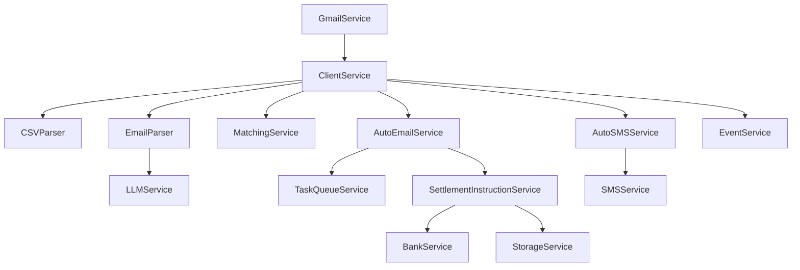

# Services Documentation

The services layer contains all the business logic for the CCM 2.0 backend. Each service is responsible for a specific domain area.

## Core Services

### [Client Service](client_service.md)
The central orchestrator for all client-related operations. Manages trade processing, email confirmations, matching workflows, and client configuration.

- **Lines of Code**: ~2700
- **Methods**: 54
- **Dependencies**: CSV Parser, Email Parser, LLM Service, Matching Service, Task Queue, Auto Email/SMS

### [Gmail Service](gmail_service.md)
Gmail API integration for monitoring inbox and sending emails.

- **Key Features**: Continuous monitoring, domain-wide delegation, automatic client identification
- **Monitored Account**: confirmaciones_dev@servicios.palace.cl

### [LLM Service](llm_service.md)
AI-powered trade data extraction from email confirmations.

- **Provider**: Anthropic Claude (claude-sonnet-4-5)
- **Processing Time**: ~2-3 seconds per email

### [Matching Service](matching_service.md)
Fuzzy matching algorithm for pairing bank confirmations with client trades.

- **Algorithm Version**: v2.0 Enhanced
- **Match Threshold**: 60 points minimum
- **Auto-confirm Threshold**: 70 points

### [Settlement Instruction Service](settlement_instruction_service.md)
Generates populated settlement instruction documents from templates.

- **Template Format**: DOCX
- **Variable Replacement**: Trade details, accounts, localized terms
- **Multi-language**: Spanish, English, Portuguese

### [Bank Service](bank_service.md)
Manages bank configuration, client segmentation, and settlement templates.

- **Key Features**: Client segments, settlement letter templates, PDF preview generation

### [Event Service](event_service.md)
Real-time event notification system using Server-Sent Events (SSE).

- **Event Types**: trade_matched, email_processed, settlement_generated, system_alert
- **Features**: Client filtering, priority levels, connection management

## Support Services

### [Task Queue Service](task_queue_service.md)
Background job scheduling via Google Cloud Tasks.

- **Queues**: GENERAL, EMAIL, PRIORITY, FILE_PROCESSING
- **Max Delays**: 1-24 hours depending on queue

### [Auto Email Service](auto_email_service.md)
Automated email scheduling for confirmations and disputes.

- **Default Delays**: 30min (confirmation), 60min (dispute)
- **Features**: Auto-settlement attachment, multi-language support

### [Auto SMS Service](auto_sms_service.md)
SMS notifications for trade events.

- **Provider**: Bird API
- **Message Limit**: 160 characters
- **Rate Limit**: 10/minute default

### [Storage Service](storage_service.md)
Google Cloud Storage integration for documents.

- **Bucket**: ccm-dev-pool-settlement-documents
- **Region**: southamerica-west1 (Santiago)
- **Features**: CMEK encryption, signed URLs

### [User Service](user_service.md)
User profile and permission management.

- **Features**: Role-based permissions, organization references, login tracking

## Parser Services

### [CSV Parser](csv_parser.md)
Parses client trade CSV files.

- **Date Format**: DD/MM/YYYY → DD-MM-YYYY conversion
- **Field Mapping**: Column name normalization

### [Email Parser](email_parser.md)
Extracts trade data from MSG and PDF email files.

- **Priority**: PDF attachments > Email body
- **Output**: Structured JSON matching v1.0 spec

## Service Dependencies



## Common Patterns

All services follow these patterns:

1. **Error Handling**: Try/except with contextual logging
2. **Return Values**: None or empty collections on error
3. **Database Access**: CMEK Firestore via `get_cmek_firestore_client()`
4. **Async Operations**: Most I/O operations are async
5. **Audit Trail**: last_updated_by and last_updated_at fields

## Best Practices

When working with services:

1. **Always check return values** - Services return None on error
2. **Use transactions** for multi-document updates
3. **Log with context** - Include client_id, trade_number, etc.
4. **Handle rate limits** - Especially for external APIs
5. **Cache when possible** - Reduce database queries

## Service Initialization

Most services use singleton pattern:

```python
# Singleton instances
from services.client_service import ClientService
from services.gmail_service import gmail_service
from services.event_service import event_service

# Create service instance
client_service = ClientService()

# Use the service
result = await client_service.process_csv_upload(...)
```

## Performance Considerations

- **ClientService**: Large methods, consider refactoring
- **LLM Service**: 2-3 second latency per call
- **Matching Service**: O(n*m) complexity
- **Gmail Service**: 30-second polling interval
- **SMS Service**: Rate limited to 10/minute