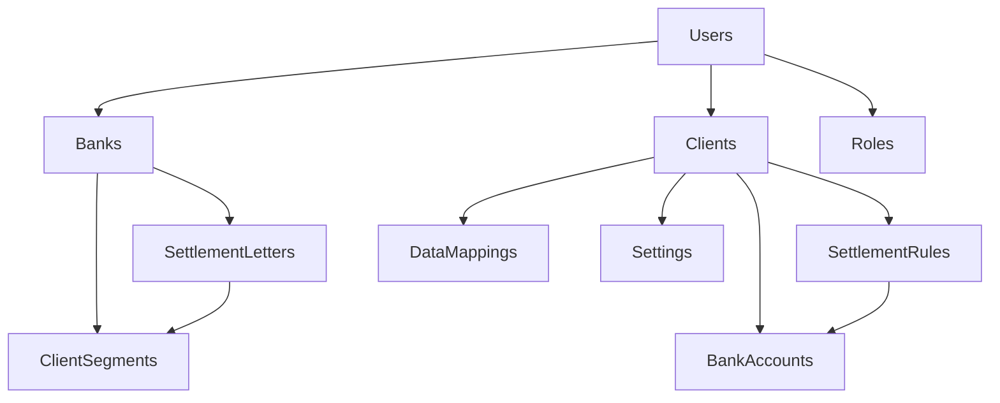

# Client Confirmation Manager - Firestore Database Structure

## 🎯 **Overview**

This document defines the complete Firestore NoSQL database structure for the Client Confirmation Manager application. The structure supports multi-tenant architecture with banks, clients, users, and their respective configurations.

## 🔧 **Design Principles**

- **Multi-tenant**: Banks and clients are isolated from each other
- **Role-based access**: Flexible permission system with role references  
- **Audit trail**: Track who made changes and when
- **Scalable**: Subcollections for related data to avoid document size limits
- **Flexible**: Schema-less structure allows for easy evolution

---

## 🔑 **`roles`** (Top-level Collection)

Defines all available roles and their specific permissions across the application.

```
/roles/{roleId}
```

**Documents:**
- `/roles/client_admin`
- `/roles/client_user` 
- `/roles/bank_admin`

**Fields:**
- `displayName`: `string` - Human-readable role name
- `description`: `string` - Role description
- `permissions`: `array<string>` - List of permission keys
- `createdAt`: `timestamp`
- `lastUpdatedAt`: `timestamp`

**Example Permissions:**
- Client Admin: `["view_dashboard", "manage_settings", "manage_settlement_rules", "manage_bank_accounts", "manage_data_mappings", "manage_users"]`
- Client User: `["view_dashboard", "view_trades", "view_confirmations"]`
- Bank Admin: `["manage_client_segments", "manage_instruction_letters", "view_all_clients"]`

---

## 🏛️ **`banks`** (Top-level Collection)

Stores bank entities and their configurations.

```
/banks/{bankId}
```

**Root Document Fields:**
- `name`: `string` - Bank name (e.g., "Banco ABC")
- `taxId`: `string` - Tax identification number (e.g., "96.543.210-K")
- `country`: `string` - Country code (e.g., "CL", "US")
- `swiftCode`: `string` - Bank's SWIFT/BIC code (optional)
- `status`: `string` - Bank status (`active`, `inactive`, `suspended`)
- `createdAt`: `timestamp`
- `lastUpdatedAt`: `timestamp`
- `lastUpdatedBy`: `reference` - Reference to `/users/{userId}`

### **Subcollections:**

#### `/banks/{bankId}/clientSegments`
```
/banks/{bankId}/clientSegments/{segmentId}
```
- `name`: `string` - Segment name (e.g., "Premium Clients")
- `description`: `string` - Segment description
- `createdAt`: `timestamp`
- `lastUpdatedAt`: `timestamp`
- `lastUpdatedBy`: `reference`

#### `/banks/{bankId}/settlementInstructionLetters`
```
/banks/{bankId}/settlementInstructionLetters/{letterId}
```
- `active`: `boolean` - Whether the letter template is active
- `priority`: `number` - Priority order for template selection
- `ruleName`: `string` - Template rule name
- `product`: `string` - Financial product type (`FX_SPOT`, `FX_FORWARD`, `FX_SWAP`)
- `clientSegmentId`: `reference` - Reference to segment (optional)
- `documentName`: `string` - Original document filename
- `documentUrl`: `string` - Cloud storage URL for the document
- `templateVariables`: `array<string>` - Available template variables
- `createdAt`: `timestamp`
- `lastUpdatedAt`: `timestamp`
- `lastUpdatedBy`: `reference`

#### `/banks/{bankId}/systemSettings`
```
/banks/{bankId}/systemSettings/configuration
```
Single document with bank-level system settings:
- `defaultCurrency`: `string` - Bank's default currency
- `supportedCurrencies`: `array<string>` - List of supported currencies
- `supportedProducts`: `array<string>` - List of supported financial products
- `lastUpdatedAt`: `timestamp`
- `lastUpdatedBy`: `reference`

---

## 🏢 **`clients`** (Top-level Collection)

Stores client companies and their comprehensive configurations.

```
/clients/{clientId}
```

**Root Document Fields:**
- `name`: `string` - Client company name
- `taxId`: `string` - Client tax identification number  
- `bankId`: `reference` - Reference to `/banks/{bankId}`
- `onboardingDate`: `timestamp` - When client was onboarded
- `createdAt`: `timestamp`
- `lastUpdatedAt`: `timestamp`
- `lastUpdatedBy`: `reference`

### **Subcollections:**

#### `/clients/{clientId}/settings`
```
/clients/{clientId}/settings/configuration
```
Single document containing all client admin settings:

**Automation Settings:**
- `automation`: `map`
  - `dataSharing`: `boolean` - Allow sharing confirmed trade data with banks
  - `autoConfirmMatched`: `map`
    - `enabled`: `boolean`
    - `delayMinutes`: `number` - Delay before auto-confirmation
  - `autoCartaInstruccion`: `boolean` - Auto-generate settlement instructions
  - `autoConfirmDisputed`: `map`
    - `enabled`: `boolean`
    - `delayMinutes`: `number`

**Alert Settings:**
- `alerts`: `map`
  - `emailConfirmedTrades`: `map`
    - `enabled`: `boolean`
    - `emails`: `array<string>`
  - `emailDisputedTrades`: `map`
    - `enabled`: `boolean`
    - `emails`: `array<string>`
  - `smsConfirmedTrades`: `map`
    - `enabled`: `boolean`
    - `phones`: `array<string>`
  - `smsDisputedTrades`: `map`
    - `enabled`: `boolean`
    - `phones`: `array<string>`

**System Settings:**
- `preferences`: `map`
  - `language`: `string` - Default language (`en`, `es`, `pt`)
  - `timezone`: `string`
  - `dateFormat`: `string`
  - `numberFormat`: `string`
- `lastUpdatedAt`: `timestamp`
- `lastUpdatedBy`: `reference`

#### `/clients/{clientId}/bankAccounts`
```
/clients/{clientId}/bankAccounts/{accountId}
```
- `active`: `boolean` - Whether the account is active
- `accountName`: `string` - Internal name for the account
- `bankName`: `string` - Name of the bank holding the account
- `swiftCode`: `string` - Bank's SWIFT/BIC code
- `accountCurrency`: `string` - Account currency (ISO code)
- `accountNumber`: `string` - Account number (encrypted)
- `isDefault`: `boolean` - Whether this is the default account for the currency
- `createdAt`: `timestamp`
- `lastUpdatedAt`: `timestamp`
- `lastUpdatedBy`: `reference`

#### `/clients/{clientId}/settlementRules`
```
/clients/{clientId}/settlementRules/{ruleId}
```
- `active`: `boolean` - Whether the rule is active
- `priority`: `number` - Rule priority (lower number = higher priority)
- `name`: `string` - Rule name
- `counterparty`: `string` - Counterparty name (bank)
- `cashflowCurrency`: `string` - Currency for the cashflow
- `direction`: `string` - Flow direction (`IN`, `OUT`)
- `product`: `string` - Financial product type
- `bankAccountId`: `reference` - Reference to bank account to use
- `createdAt`: `timestamp`
- `lastUpdatedAt`: `timestamp`
- `lastUpdatedBy`: `reference`

#### `/clients/{clientId}/dataMappings`
```
/clients/{clientId}/dataMappings/{mappingId}
```
- `name`: `string` - Mapping configuration name
- `description`: `string` - Description of the mapping
- `fileType`: `string` - Source file type (`csv`, `excel`, `json`)
- `isDefault`: `boolean` - Whether this is the default mapping for the file type
- `fieldMappings`: `array<map>` - Array of field mapping objects
  - `sourceField`: `string` - Source column/field name
  - `targetField`: `string` - Target system field name
  - `transformation`: `map` - Transformation rules
    - `type`: `string` - Transformation type (`direct`, `format`, `enum`, `split`, `combine`)
    - `params`: `map` - Transformation parameters
- `expectedFields`: `array<map>` - Expected field definitions
  - `name`: `string`
  - `type`: `string`
  - `required`: `boolean`
  - `format`: `string`
  - `enumValues`: `array<string>` (optional)
- `lastUsedAt`: `timestamp` - When this mapping was last used
- `usageCount`: `number` - How many times this mapping has been used
- `createdAt`: `timestamp`
- `lastUpdatedAt`: `timestamp`
- `lastUpdatedBy`: `reference`

#### `/clients/{clientId}/users`
```
/clients/{clientId}/users/{userId}
```
Client-specific user settings and overrides:
- `userId`: `reference` - Reference to main user document
- `clientSpecificRole`: `reference` - Client-specific role override (optional)
- `permissions`: `array<string>` - Additional client-specific permissions
- `preferences`: `map` - User preferences for this specific client
- `lastAccessAt`: `timestamp`
- `isActive`: `boolean`
- `createdAt`: `timestamp`
- `lastUpdatedAt`: `timestamp`

---

## 👤 **`users`** (Top-level Collection)

Stores all application users with their profile information and role assignments.

```
/users/{userId}
```
*Note: `userId` should be the Firebase Auth UID for seamless integration*

**Fields:**
- `firstName`: `string` - User's first name
- `lastName`: `string` - User's last name
- `email`: `string` - User's email (matches Firebase Auth)
- `roles`: `array<reference>` - References to role documents
- `primaryRole`: `reference` - Reference to primary/default role
- `organizationId`: `reference` - Reference to bank or client (depending on role)
- `organizationType`: `string` - Type of organization (`bank`, `client`)
- `language`: `string` - User's preferred language
- `timezone`: `string` - User's timezone
- `loginMetadata`: `map` - Login tracking
  - `lastLoginAt`: `timestamp`
  - `lastLoginIP`: `string`
  - `loginCount`: `number`
- `status`: `string` - User status (`active`, `inactive`, `pending`, `suspended`)
- `emailVerified`: `boolean` - Whether email is verified
- `twoFactorEnabled`: `boolean` - Whether 2FA is enabled
- `createdAt`: `timestamp`
- `lastUpdatedAt`: `timestamp`
- `lastUpdatedBy`: `reference`

---

## 📊 **`systemSettings`** (Top-level Collection)

Global system settings and configurations.

```
/systemSettings/configuration
```
Single document with global settings:
- `supportedLanguages`: `array<string>` - Supported languages
- `supportedCurrencies`: `array<string>` - All supported currencies
- `supportedProducts`: `array<string>` - All supported financial products  
- `supportedCountries`: `array<string>` - Supported countries
- `systemMaintenance`: `map` - Maintenance settings
  - `isUnderMaintenance`: `boolean`
  - `maintenanceMessage`: `string`
  - `scheduledMaintenanceAt`: `timestamp`
- `defaultSettings`: `map` - Default system settings
- `featureFlags`: `map` - Feature toggles
- `lastUpdatedAt`: `timestamp`
- `lastUpdatedBy`: `reference`

---

## 🔐 **Security Rules Considerations**

The database structure supports these security patterns:

1. **Role-based access**: Users can only access resources their roles permit
2. **Organization isolation**: Bank users can't access other banks' data
3. **Client isolation**: Client users can only access their own client data
4. **Audit trail**: All changes tracked with user and timestamp
5. **Data encryption**: Sensitive fields like account numbers should be encrypted

---

## 📈 **Scalability Considerations**

1. **Subcollections**: Used to avoid document size limits and enable efficient queries
2. **Denormalization**: Some data intentionally duplicated for query performance
3. **Indexes**: Strategic compound indexes for common query patterns
4. **Pagination**: All list views should implement cursor-based pagination
5. **Caching**: Frequently accessed configuration data should be cached

---

## 🔄 **Data Relationships**



---

## 🛠️ **Migration Strategy**

When implementing this structure:

1. **Phase 1**: Create roles and system settings
2. **Phase 2**: Create banks and their configurations
3. **Phase 3**: Create clients and their basic settings
4. **Phase 4**: Migrate users and assign roles
5. **Phase 5**: Add client-specific configurations and relationships

This structure provides a solid foundation for your Client Confirmation Manager while maintaining flexibility for future enhancements!